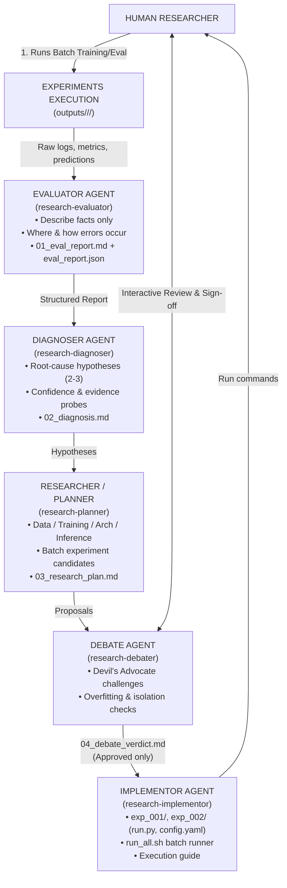

# AI Research Experiment Loop Architecture

## Objective

A **Human-in-the-loop AI Research System** supporting the iterative lifecycle:

> Experiment → Evaluate → Diagnose → Research → Debate → Implement → Experiment

The AI Agent **never runs training/heavy compute autonomously**. The Human researcher is the ultimate arbiter, reviewer, and executor.

---

## Architecture Overview



---

## The 6 Roles & Skills

| Step | Role | Agent Skill | Primary Responsibility | Strict Constraint | Key Artifact |
| :--- | :--- | :--- | :--- | :--- | :--- |
| **1** | Evaluator | `research-evaluator` | Analyzes facts, metrics, failure slices, and error cases from `outputs/`. | **Evidence only**. No root cause or solution claims. | `01_eval_report.md`, `eval_report.json` |
| **2** | Diagnoser | `research-diagnoser` | Formulates 2–3 root-cause hypotheses with confidence & evidence. | **No code solutions**. Isolates diagnostic probes. | `02_diagnosis.md` |
| **3** | Researcher / Planner | `research-planner` | Investigates literature/code, plans isolated batch experiments. | Must isolate **one variable** per experiment. | `03_research_plan.md` |
| **4** | Debate & Human | `research-debater` | Challenges assumptions, checks for overfitting, secures Human approval. | **Gatekeeper**: Agent cannot implement without Human sign-off. | `04_debate_verdict.md` |
| **5** | Implementor | `research-implementor` | Scaffolds code, configs, instructions, and batch scripts. | **Never runs training**. Prepares files for Human execution. | `exp_001/run.py`, `config.yaml`, `run_all.sh` |
| **6** | Human Executor | **Human** | Runs the training/inference commands on target hardware. | Stores outputs in `outputs/<track>/<iter>/`. | Weights, predictions, logs |

---

## Directory & Storage Layout

```
ai4training-aicore-poc/
├── .agents/
│   ├── rules/
│   │   └── research_loop.md             # Enforces loop rules repository-wide
│   └── skills/
│       ├── research-evaluator/SKILL.md  # Step 1
│       ├── research-diagnoser/SKILL.md  # Step 2
│       ├── research-planner/SKILL.md    # Step 3
│       ├── research-debater/SKILL.md    # Step 4
│       ├── research-implementor/SKILL.md# Step 5
│       └── research-loop/SKILL.md       # Master Orchestrator
│
├── experiments/                         # [LIGHTWEIGHT, GIT-TRACKED]
│   ├── action_segment/                  # Track A: Kinematic + VLM
│   │   ├── TRACKER.md                   # Single source of truth dashboard
│   │   ├── iter_00_baseline/            # Established baseline (9 CĐ recall)
│   │   │   ├── README.md
│   │   │   ├── eval_report.json
│   │   │   └── evaluation_result_9cd.xlsx
│   │   └── iter_01/                     # Active / Next iteration
│   │       ├── 01_eval_report.md
│   │       ├── 02_diagnosis.md
│   │       ├── 03_research_plan.md
│   │       ├── 04_debate_verdict.md
│   │       ├── batch_eval_summary.md
│   │       ├── run_all.sh
│   │       ├── exp_001_wrist_filter/
│   │       │   ├── run.py
│   │       │   ├── config.yaml
│   │       │   └── README.md
│   │       └── exp_002_adaptive_th/
│   │           ├── run.py
│   │           ├── config.yaml
│   │           └── README.md
│   │
│   ├── step_segment/                    # Track B: DDM-Net, DiffGEBD, EfficientGEBD
│   │   └── TRACKER.md
│   │
│   └── templates/                       # Reusable schemas & templates
│       ├── eval_report_schema.json
│       ├── 01_eval_report_template.md
│       ├── 02_diagnosis_template.md
│       ├── 03_research_plan_template.md
│       ├── 04_debate_verdict_template.md
│       ├── batch_eval_summary_template.md
│       ├── experiment_setup_template.py
│       ├── exp_config_template.yaml
│       └── run_all_template.sh
│
└── outputs/                             # [HEAVY, GIT-IGNORED]
    ├── action_segment/
    │   └── iter_01/
    │       ├── exp_001_wrist_filter/   # logs, predictions, clips
    │       └── exp_002_adaptive_th/
    └── step_segment/
```
