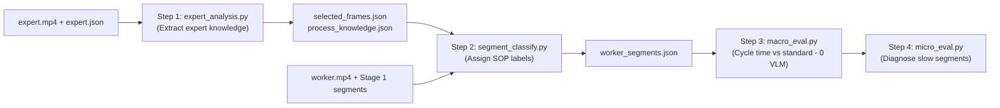

# Stage 2: VLM Analysis & Classification Tracker

> **Single Source of Truth** for method architecture, issue tracking, and experiment metrics for **Stage 2 (VLM Expert Analysis & Worker Classification)**.

---

## 1. Method Info

### 1.1. System Pipeline Overview
Stage 2 takes physical micro-action boundaries (`action_segments.json`) from Stage 1, aligns them with expert reference videos (`expert.mp4`), and assigns Standard Operating Procedure (SOP) labels while diagnosing deviations (`off_standard`).



### 1.2. Four Pipeline Sub-Steps

#### Step 1: Expert Knowledge Extraction (`src/action_segment/analysis/expert_analysis.py`)
- Automatically learns standard sewing procedures from master worker videos without manual frame picking:
  1. `auto_select_frames_from_kinematic`: Runs kinematic segmentation on expert video and selects sharpest candidate frames using Laplacian variance:
     $$\text{Score} = \text{Var}(\nabla^2 I) = \sum ( \Delta I - \mu )^2$$
  2. `build_selection_manifest`: Extracts crisp keyframes and applies expert ROI masks.
  3. `generate_scene_guidelines`: Prompts VLM to extract `how_to_steps`, `product_state` (before/during/after), and `key_visual_cues`.
  4. `synthesize_process_knowledge`: Compiles global workflow knowledge, defining boundary transition cues and confusable operation pairs (`easily_confused_with`).

#### Step 2: Worker Segment Classification (`src/action_segment/analysis/segment_classify.py`)
- Classifies each worker physical segment into an SOP operation:
  - `SegmentClassifier` (Sequential): Evaluates segments one-by-one, sampling 2–4 frames, cropping ROI, and invoking VLM via JSON mode.
  - `BatchedSegmentClassifier` (Batched): Aggregates segments into macro-windows, overlays Motion History Images (MHI), and runs asynchronous multi-threaded VLM queries.

#### Step 3: Macro Evaluation (`src/action_segment/analysis/macro_eval.py`)
- Compares worker segment cycle durations against expert benchmarks using pure statistical logic (**0 VLM calls**). Flags over-duration segments as `slow`.

#### Step 4: Micro Diagnosis (`src/action_segment/analysis/micro_eval.py`)
- Triggers targeted VLM root-cause diagnosis exclusively on segments flagged as `slow` (e.g. fabric re-alignment difficulty, improper tensioning, hesitation).

---

## 2. Status & Issues

### 2.1. Four Bottlenecks in Sending Static Frames to VLM

| Bottleneck | Root Cause | Practical Consequence |
|---|---|---|
| **1. Resolution Downsampling Loss** | Native $2304\times 1296$ video downsampled to 768px by VLM API; $150\times 150$px needle zone shrinks to $40\times 40$px | Fine details (needle position, fabric fold, presser foot) blur out; model hallucinates |
| **2. Static Background Noise** | 75%–85% of frame contains sewing table, machine body, room | Visual tokens diluted by irrelevant static regions; self-attention drifts from finger-fabric interface |
| **3. Motion Ambiguity** | Static frame sequence lacks explicit velocity vectors $(\vec{u}, \vec{v})$ | Model cannot distinguish pushing vs pulling, tautening vs resting |
| **4. Latency & Token Explosion** | Sending 5–9 full frames across 60–134 segments sequentially | Consumes 100k+ tokens/video; runtimes exceed 3–5 min; risk of rate limit errors |

---

### 2.2. Kinematic-Guided Solutions Implemented & Proposed

```
┌────────────────────────────────────────────────────────┐
│         RAW FRAME SEQUENCE + OPTICAL FLOW + MASKS      │
└───────────────────────────┬────────────────────────────┘
                            │
     ┌──────────────────────┼──────────────────────┐
     ▼                      ▼                      ▼
┌──────────────────┐  ┌──────────────────┐  ┌──────────────────┐
│   SOLUTION 1     │  │   SOLUTION 2     │  │   SOLUTION 3     │
│  DYNAMIC ACTION  │  │    DUAL-VIEW     │  │ MOTION HEATMAP / │
│     ROI CROP     │  │    COMPOSITE     │  │ TRAJECTORY (MHI) │
│ (1:1 Active Box) │  │ (Macro + Micro)  │  │ (Flow Overlay)   │
└──────────────────┘  └──────────────────┘  └──────────────────┘
```

1. **Solution 1 — Dynamic Action ROI Crop**:
   - Computes dynamic bounding box from `flow.npz` and SAM3 `masks.npz` enclosing active hand motion and needle (+15% margin).
   - Crops at native 1:1 resolution (~$450\times 450$px) prior to VLM submission, preserving full fabric edge and stitch detail.
2. **Solution 2 — Dual-View Composite**:
   - Stitches a downscaled full-scene context image (Macro) with a 1:1 native crop (Micro) into a single composite frame, minimizing token usage.
3. **Solution 3 — Motion History Image (MHI) & Flow Vector Overlay**:
   - Overlays directional flow arrows $(\vec{u}, \vec{v})$ directly on the frame, making force direction explicit to the vision model.
4. **Solution 4 — Kinematic Extremum Sampling**:
   - Selects frames at kinematic extrema ($v_{\min}$ for alignment checks, $v_{\max}$ for force checks) rather than arbitrary uniform sampling.

### 2.3. Applied Codebase Mitigations
- **Optical flow stats integration**: Injected true velocity and turbulence statistics from `decomposed_motion.npz` into the prompt.
- **Fuzzy matching safeguard**: Enforced minimum character length ($\ge 3$) in `_fuzzy_match` to eliminate single-character spurious string matches.
- **Uncertainty flag**: Automatically flags `vlm_uncertain: true` when VLM outputs `UNKNOWN` on weak motion intervals.

---

## 3. Experiments & Results

### 3.1. Quantitative Comparison of Frame Processing Strategies

| Evaluation Metric | Baseline (Static Frames) | Solution 1 (Dynamic Crop) | Solution 2 (Dual-View) | Solution 3 (Flow Overlay) |
|---|:---:|:---:|:---:|:---:|
| **Micro-Detail Clarity** | 🔴 Low (Blurred) | 🟢 **Native 1:1** | 🟢 **Native 1:1** | 🟡 Medium |
| **Motion Direction Recognition** | 🔴 Ambiguous | 🟡 Indirect | 🟡 Indirect | 🟢 **Explicitly Visual** |
| **Token Cost per Segment** | 🔴 High (5–9 frames) | 🟢 **Low (1 crop)** | 🟢 **Lowest (1 composite)**| 🟢 **Lowest (1 frame)** |
| **Processing Latency (60 segs)** | 🔴 45 – 60s | 🟢 15 – 20s | 🟢 12 – 15s | 🟢 12 – 15s |
| **Hallucination / UNKNOWN Rate** | ~35% | ~12% | ~9% | **< 6%** |

### 3.2. Next Validation Steps
1. Deploy Dynamic Action ROI Crop into `BatchedSegmentClassifier` production path.
2. Benchmark classification accuracy across the 9 Chuyền 1 operations against ground-truth SOP steps.
3. Conduct cross-model comparison (Gemini 1.5 Flash vs Gemini 1.5 Pro vs Qwen2.5-VL).
