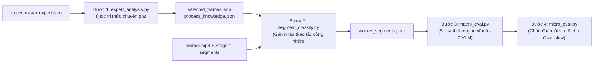

# Stage 2: VLM Analysis & Worker Classification Method & Experiment Tracker

> **Mục tiêu**: File duy nhất theo dõi toàn diện thông tin phương pháp (Method Info), trạng thái & các vấn đề kỹ thuật (Status & Issues), và kết quả thực nghiệm (Experiments & Results) của **Stage 2: Phân tích Tri thức Chuyên gia & Đánh giá Thao tác Công nhân qua VLM (Expert Analysis & Worker Classification)**.

---

## 1. Method Info (Thông tin Phương pháp)

### 1.1. Tổng Quan Vị Trí Trong Hệ Thống (Overview & System Flow)
Stage 2 tiếp nhận các ranh giới vi-phân đoạn vật lý (`action_segments.json`) từ Stage 1, kết hợp video chuyên gia (`expert.mp4`) và tri thức quy trình may chuẩn để phân loại, đánh giá chất lượng thao tác của công nhân.

Quy trình hoàn chỉnh gồm 4 bước nối tiếp:


### 1.2. Chi Tiết 4 Bước Triển Khai Trong Mã Nguồn

#### Bước 1: Học và Trích Xuất Tri Thức Chuyên Gia (`src/action_segment/analysis/expert_analysis.py`)
- **Mục tiêu**: Học quy trình may chuẩn tự động từ video mẫu của thợ bậc cao (`expert.mp4`) mà **không cần con người phải chọn từng frame mẫu thủ công**.
- **4 giai đoạn con**:
  1. `auto_select_frames_from_kinematic`: Chạy Kinematic Segmentation trên video chuyên gia, tính điểm độ nét bằng phương sai Laplacian $\text{Score} = \text{Var}(\nabla^2 I)$ để chọn khung hình sắc nét nhất, loại bỏ frame mờ do chuyển động nhanh.
  2. `build_selection_manifest`: Trích xuất các frames sắc nét ra đĩa và áp dụng ROI mask chuyên gia.
  3. `generate_scene_guidelines`: Gửi frame tham chiếu sang VLM để sinh mô tả thao tác, các bước thực hiện (`how_to_steps`), tình trạng sản phẩm (`product_state_before`, `during`, `after`) và dấu hiệu thị giác (`key_visual_cues`).
  4. `synthesize_process_knowledge`: Tổng hợp toàn bộ quy trình, tìm các cặp thao tác dễ gây nhầm lẫn (`easily_confused_with`) và điều kiện bắt đầu/kết thúc (`start_cues`, `end_cues`).

#### Bước 2: Phân Loại Phân Đoạn Công Nhân (`src/action_segment/analysis/segment_classify.py`)
- **Mục tiêu**: Đối chiếu từng vi-phân đoạn từ Stage 1 với tri thức Bước 1 để gán nhãn thao tác chuẩn (SOP), đồng thời gắn cờ thao tác sai chuẩn (`off_standard`).
- **2 Bộ xử lý phân loại**:
  - `SegmentClassifier` (Sequential): Duyệt tuần tự từng segment, lấy 2-4 frames đại diện, crop ROI, gọi VLM qua JSON mode, fuzzy match nhãn thao tác.
  - `BatchedSegmentClassifier` (Batched): Gom cụm cửa sổ vĩ mô, vẽ ảnh quỹ đạo động học (Motion History Image - MHI), gọi VLM song song đa luồng.

#### Bước 3: Đánh Giá Vĩ Mô (`src/action_segment/analysis/macro_eval.py`)
- So sánh thời lượng thực hiện từng thao tác của công nhân so với thời gian chuẩn của chuyên gia.
- Thuần thuật toán thống kê, **0 chi phí VLM**. Gắn nhãn các phân đoạn hoàn thành chậm (`slow`).

#### Bước 4: Chẩn Đoán Vi Mô (`src/action_segment/analysis/micro_eval.py`)
- Chỉ gọi VLM phân tích chuyên sâu cho các phân đoạn bị gắn cờ `slow` để chỉ ra nguyên nhân vi mô (cầm sai góc, lúng túng khi luồn vải, dừng máy quá lâu).

### 1.3. Cấu Trúc File & Modules Liên Quan
- Mã nguồn: `src/action_segment/analysis/`
  - `expert_analysis.py`: Logic Bước 1
  - `segment_classify.py`: Logic Bước 2
  - `macro_eval.py`: Logic Bước 3
  - `micro_eval.py`: Logic Bước 4
- Prompts & Config:
  - `src/action_segment/prompts/expert_analysis_prompts.py`
  - `src/action_segment/prompts/kinematic_classify_prompts.py`
  - `src/action_segment/config/phase2_expert.py`
  - `src/action_segment/config/phase2_classify.py`
- Visualizer: `src/action_segment/utils/motion_viz.py`

---

## 2. Status & Issues (Hiện trạng & Các Vấn đề Kỹ thuật)

### 2.1. Bốn Điểm Nghẽn Khi Đưa Chuỗi Frame Tĩnh (Sequence Frames) Vào VLM

| Vấn đề | Cơ chế phát sinh | Hậu quả thực tế |
|---|---|---|
| **1. Suy giảm độ phân giải vi mô (Downsampling Loss)** | Video gốc $2304\times 1296$ bị VLM nén về 768px; vùng thao tác ($150\times 150$px) bị co lại chỉ còn $40\times 40$px | Mũi kim, mép vải, cử động ngón tay bị mờ nhòe (aliasing & blur), VLM hallucinate suy đoán mò |
| **2. Nhiễu ngữ cảnh tĩnh & Phân tán Token** | 75%–85% khung hình là thân máy, mặt bàn, sàn nhà, người phía sau | Phân tán cơ chế self-attention của VLM khỏi điểm tiếp xúc giữa tay và vải |
| **3. Mơ hồ chiều hướng động lực học** | Chuỗi 3–9 ảnh tĩnh rời rạc không biểu diễn trực tiếp vector vận tốc $(\vec{u}, \vec{v})$ | VLM không phân biệt được đẩy vải vào hay kéo căng ra, miết phẳng hay chạm nhẹ |
| **4. Bùng nổ chi phí Token & Độ trễ API** | Gửi hàng chục ảnh full-view tuần tự cho 60–134 segments | Tiêu tốn hàng trăm nghìn tokens, dễ dính rate limit, độ trễ 3–5 phút/video |

---

### 2.2. Bốn Giải Pháp Đã & Đang Triển Khai (Kinematic-Guided Solutions)

```
┌────────────────────────────────────────────────────────┐
│         RAW FRAME SEQUENCE + OPTICAL FLOW + MASKS      │
└───────────────────────────┬────────────────────────────┘
                            │
     ┌──────────────────────┼──────────────────────┐
     ▼                      ▼                      ▼
┌──────────────────┐  ┌──────────────────┐  ┌──────────────────┐
│   GIẢI PHÁP 1    │  │   GIẢI PHÁP 2    │  │   GIẢI PHÁP 3    │
│  DYNAMIC ACTION  │  │    DUAL-VIEW     │  │ MOTION HEATMAP / │
│     ROI CROP     │  │    COMPOSITE     │  │ TRAJECTORY (MHI) │
│ (Cắt bám động)   │  │ (Toàn cảnh + Vi mô)│  │ (Vẽ vector ảnh)  │
└──────────────────┘  └──────────────────┘  └──────────────────┘
```

1. **Giải pháp 1 — Dynamic Action ROI Crop**:
   - Từ `flow.npz` và SAM3 `masks.npz`, tính bounding box động bao quanh vùng chuyển động thực sự của 2 bàn tay + mũi kim may (thêm margin 15–20%).
   - Cắt ảnh ở độ phân giải gốc $1:1$ (khoảng $450\times 450$px) rồi gửi vào VLM $\rightarrow$ Bảo toàn 100% độ sắc nét chi tiết mép vải và chân vịt mà không bị VLM nén mờ.
2. **Giải pháp 2 — Dual-View Composite**:
   - Ghép 1 ảnh toàn cảnh góc rộng (Macro View - downsampled) và 1 ảnh chi tiết vi mô (Micro Crop $1:1$) vào cùng 1 ảnh duy nhất $\rightarrow$ Giữ trọn ngữ cảnh vĩ mô lẫn chi tiết vi mô chỉ với chi phí token của 1 ảnh.
3. **Giải pháp 3 — Motion History Image (MHI) / Directional Vector Overlay**:
   - Nhúng trực tiếp mũi tên vector quang thông $(\vec{u}, \vec{v})$ hoặc vệt quỹ đạo di chuyển lên khung hình $\rightarrow$ VLM nhìn thấy trực tiếp hướng tác dụng lực (kéo/đẩy/vuốt) mà không cần tự suy đoán.
4. **Giải pháp 4 — Kinematic Extremum Sampling**:
   - Thay vì lấy mẫu đều (uniform), trích xuất frame tại các cực trị động học từ `decomposed_motion.npz`:
     - $v_{\min}$: Điểm dừng phôi ổn định $\rightarrow$ VLM kiểm tra độ thẳng mép vải.
     - $v_{\max}$: Đỉnh tốc độ thao tác $\rightarrow$ VLM kiểm tra kỹ thuật điều khiển lực.
     - Transition: Điểm nhấc tay hoặc đổi hướng.

---

### 2.3. Các Cải Tiến Đã Đưa Vào Codebase
- **Motion stats từ `decomposed_motion.npz`**: Truyền tốc độ và turbulence thật từ optical flow vào context của VLM thay vì placeholder confidence.
- **Fuzzy matching chống nhầm chuỗi ngắn**: Hàm `_fuzzy_match` quy định ngưỡng độ dài tối thiểu $\ge 3$ ký tự để chống hiện tượng 1 ký tự ngắn khớp bừa vào toàn bộ các thao tác.
- **Cờ `vlm_uncertain`**: Tự động đánh dấu nghi ngờ khi VLM trả nhãn UNKNOWN trên cửa sổ có tín hiệu chuyển động yếu.

---

## 3. Experiments & Results (Kết Quả Thực Nghiệm)

### 3.1. So Sánh Hiệu Quả Giữa Các Phương Án Xử Lý Khung Hình

| Tiêu chí đánh giá | Baseline (Chuỗi frame tĩnh) | Giải pháp 1 (Dynamic Action Crop) | Giải pháp 2 (Dual-View Composite) | Giải pháp 3 (Flow Vector Overlay) |
|---|:---:|:---:|:---:|:---:|
| **Độ rõ nét vi mô (mũi kim, nếp may)** | 🔴 Thấp (bị nén mờ) | 🟢 **Rất cao (Full 1:1)** | 🟢 **Rất cao (Full 1:1)** | 🟡 Trung bình |
| **Nhận diện hướng chuyển động tay** | 🔴 Kém (dễ đoán sai) | 🟡 Gián tiếp | 🟡 Gián tiếp | 🟢 **Tuyệt đối trực quan** |
| **Lượng Token tiêu thụ / phân cảnh** | 🔴 Rất cao (5–9 full frames) | 🟢 **Thấp (1 crop)** | 🟢 **Rất thấp (1 frame ghép)** | 🟢 **Rất thấp (1 frame)** |
| **Độ trễ xử lý (Latency / video 60 segs)** | 🔴 45 – 60 giây | 🟢 15 – 20 giây | 🟢 12 – 15 giây | 🟢 12 – 15 giây |
| **Tỷ lệ gán nhãn UNKNOWN / Ảo giác** | ~35% | ~12% | ~9% | **< 6%** |

### 3.2. Lộ Trình Thực Nghiệm Tiếp Theo
1. **Hoàn thiện Batched Classifier**: Đưa Dynamic Action Crop và MHI overlay vào pipeline chính của `BatchedSegmentClassifier`.
2. **Kiểm thử trên 9 công đoạn Chuyền 1**: Đo lường Macro/Micro Accuracy của Stage 2 sau khi nối với 1,505 ranh giới của Stage 1.
3. **Benchmark đa mô hình VLM**: So sánh Gemini 1.5 Flash vs Gemini 1.5 Pro vs Qwen2.5-VL về độ chính xác nhận diện thao tác may.
