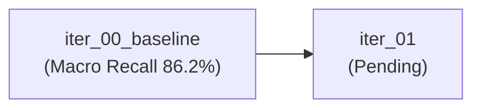

# Track: Action Segmentation & Evaluation (TRACKER)

> **Single Source of Truth** for experiments, metrics leaderboard, and hypotheses in Action Segmentation (Kinematic Pre-segmentation + VLM Process Analysis).

---

## 1. Track Overview & Architecture

- **Scope**: Evaluates worker operations against expert reference videos.
- **Stage 1 (Kinematic)**: Motion boundary detection (SAM 3 hand tracking + SEA-RAFT optical flow + speed valley fusion). Zero VLM cost.
- **Stage 2 (VLM Analysis)**: Expert guideline extraction (`expert_analysis.py`), Worker action classification (`segment_classify.py`), Macro timing comparison (`macro_eval.py`), Micro bottleneck diagnosis (`micro_eval.py`).
- **Core Documentation**:
  - [`docs/action_segment/stage1_kinematic.md`](file:///home/hungbm/ai4training/ai4training-aicore/docs/action_segment/stage1_kinematic.md)
  - [`docs/action_segment/stage2_vlm_analysis.md`](file:///home/hungbm/ai4training/ai4training-aicore/docs/action_segment/stage2_vlm_analysis.md)

---

## 2. Metrics Leaderboard

| Rank | Iteration | Experiment ID | Description | Macro Recall (%) | Micro Recall (%) | Macro F1 (%) | Step Both (%) | Status |
| :---: | :--- | :--- | :--- | :---: | :---: | :---: | :---: | :---: |
| 🥇 | `iter_00_baseline` | `stage1_baseline` | SAM3 + SEA-RAFT default fusion (window=0.5s) | **86.20** | **87.33** | 46.56 | **76.50** | **Current Champion** |
| 🥈 | `iter_00_baseline` | `stage1_tuned` | Tuned distance & thresholds | 75.20 | 72.18 | **48.13** | 52.72 | Explored (High Recall Drop) |

*Target Criteria for Promotion*: Macro Recall $\ge 88\%$, Macro F1 $\ge 60\%$, Zero regression on 9 standard operations.

---

## 3. Iteration History

| Iteration | Date | Focus / Goal | Experiments in Batch | Best Exp | Decision / Next Steps |
| :--- | :--- | :--- | :--- | :--- | :--- |
| [`iter_00_baseline`](iter_00_baseline/README.md) | 2026-09-23 | Baseline evaluation on 9 CĐ (Chuyền 1) | `stage1_baseline`, `stage1_tuned` | `stage1_baseline` | Established 86.2% Macro Recall baseline; proceed to reduce over-segmentation. |

---

## 4. Hypotheses Log

| ID | Hypothesis | Proposed In | Tested In | Evidence / Verdict | Status |
| :---: | :--- | :--- | :--- | :--- | :---: |
| **H-001** | Increasing `dist_sec` and `min_th` reduces noise segments and raises F1. | `iter_00` | `stage1_tuned` | F1 rose slightly (46.5 -> 48.1), but Macro Recall dropped heavily (-11%). | ❌ **Rejected** (Unacceptable recall loss) |
| **H-002** | Wrist-resting translation + RMS energy fusion isolates true pauses from stationary jitter. | `iter_00` | Plan for `iter_01` | Needs systematic evaluation against GT boundaries. | ⏳ **Queued for iter_01** |

---

## 5. Next Iteration Roadmap (`iter_01`)

- **Primary Goal**: Improve boundary precision (reduce false positives) while keeping Macro Recall $\ge 86\%$.
- **Planned Candidates**:
  1. `exp_001`: Wrist-resting translational thresholding vs RMS energy filter.
  2. `exp_002`: Dynamic adaptive threshold per operation speed profile.
