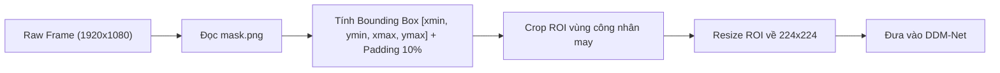
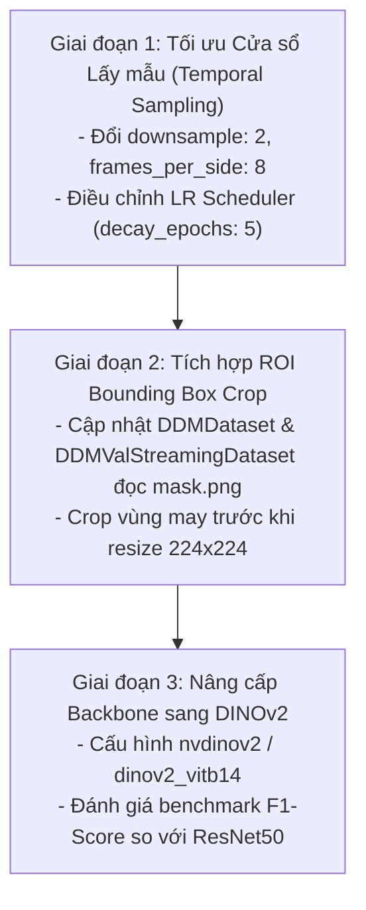

# Kế hoạch Cải tiến Mô hình Step Segmentation (DDM-Net)

Tài liệu này tổng hợp các vấn đề cốt lõi được phát hiện trong quá trình huấn luyện thực nghiệm DDM-Net trên tập dữ liệu video may công nghiệp và đề xuất các giải pháp kỹ thuật cụ thể cho các giai đoạn tiếp theo.

---

## 1. Vấn đề 1: Độ dài Thao tác Thực tế vs. Cửa sổ Lấy mẫu Của Mô hình (Action Duration vs. Temporal Receptive Field)

### 1.1. Thực trạng dữ liệu thực tế
Trích xuất thống kê từ toàn bộ **1,570 thao tác** trong tập dữ liệu:

| Chỉ số | Tập Huấn luyện (Train - 1,215 steps) | Tập Đánh giá (Val - 355 steps) |
| :--- | :---: | :---: |
| **Median (Trung vị)** | **1.84 giây** (~55 frames ở 30 FPS) | **1.43 giây** (~43 frames ở 30 FPS) |
| **Mean (Trung bình)** | **2.90 giây** (~87 frames ở 30 FPS) | **2.02 giây** (~61 frames ở 30 FPS) |
| **Khoảng 25% - 75%** | 1.09s — 3.06s | 0.79s — 2.43s |
| **Thao tác < 2 giây** | **54.0%** | **64.5%** |
| **Thao tác 2 - 5 giây** | **36.8%** | **30.4%** |
| **Thao tác > 5 giây** | **9.2%** | **5.1%** |

### 1.2. Hạn chế của cơ chế lấy mẫu hiện tại
- **Cấu hình hiện hành**: `frames_per_side: 5`, `downsample: 1`.
- **Cửa sổ thời gian mô hình nhìn thấy**:
  $$\text{Span} = 2 \times \text{frames\_per\_side} + 1 = 11\text{ frames} = \frac{11}{30} \approx \mathbf{0.37\text{ giây}}$$
- **Hệ quả**:
  - Cửa sổ 0.37 giây chỉ bao phủ $\approx 15\% - 20\%$ độ dài của một thao tác trung bình (~1.8 giây).
  - Mô hình chỉ quan sát thấy các biến đổi vi mô cục bộ ($\pm 0.18$s quanh frame trung tâm), hoàn toàn **thiếu ngữ cảnh vĩ mô** của hành động trước đó (ví dụ: đang may nẹp túi) và hành động tiếp theo (cắt chỉ hoặc đặt chi tiết mới).
  - Điều này dẫn đến hiện tượng F1-Score dễ bị trôi và nhạy cảm với các chuyển động cục bộ nhỏ.

### 1.3. Giải pháp đề xuất
Mở rộng tầm nhìn thời gian (Temporal Receptive Field) mà không làm bùng nổ số lượng tham số hay tải tính toán:
- **Tăng bước lấy mẫu (`downsample: 2`) kết hợp tăng số frame hai phía (`frames_per_side: 8`)**:
  - Số frame nạp vào tensor: $2 \times 8 + 1 = 17$ frames (chỉ tăng nhẹ từ 11 lên 17 frames).
  - Phạm vi thời gian bao phủ thực tế:
    $$\text{Span} = (2 \times 8) \times 2 + 1 = 33\text{ frames} \approx \mathbf{1.10\text{ giây}}$$
  - **Lợi ích**: Tầm nhìn 1.1s bao trọn nửa cuối của thao tác trước và nửa đầu của thao tác sau, giúp head transformer và DDM module nhận diện biên chuyển tiếp rõ ràng và chuẩn xác hơn nhiều lần.

---

## 2. Vấn đề 2: Tỷ lệ Vùng Thao tác Nhỏ & Nhiễu Hậu cảnh Xưởng may (Small ROI & Background Noise)

### 2.1. Thực trạng & Hạn chế
- Video thô được quay ở góc nhìn bao quát toàn bộ vị trí máy may với độ phân giải cao ($1920\times 1080$ hoặc $2304\times 1296$).
- Vùng thao tác trọng tâm (2 bàn tay công nhân, mặt bàn máy may, đường kim mũi chỉ) thực tế chỉ chiếm **khoảng 30% - 40%** diện tích khung hình.
- Phần còn lại (60% - 70%) là hậu cảnh xưởng: công nhân chuyền bên cạnh di chuyển, xe đẩy hàng, bóng người, ánh sáng đèn trần thay đổi.
- **Hệ quả khi Resize toàn khung hình về $224\times 224$**:
  - Bàn tay và đường may bị nén nhỏ xuống chỉ còn vài chục pixel, mất đi các chi tiết kết cấu chuyển động tinh vi.
  - Các chuyển động ngẫu nhiên của người khác ở hậu cảnh bị mô hình nhầm lẫn là chuyển động thao tác (motion noise).

### 2.2. Giải pháp đề xuất: Tự động Bounding Box Crop từ `mask.png`
Tận dụng toàn bộ các file `<video_name>.mask.png` đã được đồng bộ vào từng thư mục `data/cd*/chuyen*/`:

- **Quy trình xử lý**:
  1. Trong hàm nạp dữ liệu (`DDMDataset` và `DDMValStreamingDataset`), đọc file `*.mask.png` tương ứng của video một lần khi khởi tạo.
  2. Tìm contour bao quanh vùng mask trắng để lấy tọa độ hộp chữ nhật: $[x_{min}, y_{min}, x_{max}, y_{max}]$.
  3. Mở rộng biên (padding/margin) 5% - 10% để đảm bảo không bị cắt lẹm tay khi công nhân vươn ra lấy bán thành phẩm.
  4. Thực hiện Cắt (Crop) khung hình theo Bounding Box rồi mới Resize về $224\times 224$.
- **Lợi ích**:
  - **Tăng độ phân giải hiệu dụng gấp 2.5 - 3 lần**: Bàn tay và máy may chiếm trọn khung hình 224x224.
  - **Khử 100% nhiễu nền**: Loại bỏ hoàn toàn sự can thiệp của người ngoài và bối cảnh xưởng may.

---

## 3. Vấn đề 3: Hạn chế của Backbone ResNet50 & Lựa chọn Tối ưu cho RTX 5060 (16GB VRAM)

### 3.1. Hạn chế của ResNet50 hiện tại
- ResNet50 (146 triệu tham số tính cả head) được công bố từ 2015 và huấn luyện có giám sát (supervised) trên ImageNet 1,000 nhãn phân loại ảnh tĩnh.
- Đặc trưng trích xuất từ ResNet50 thiên về nhận diện "vật thể gì" thay vì "chuyển động hình học và ranh giới không gian - thời gian".

### 3.2. Tiềm năng phần cứng & Yêu cầu kỹ thuật
- Phần cứng huấn luyện: **GPU NVIDIA GeForce RTX 5060 (16GB VRAM)** thế hệ kiến trúc mới nhất với Tensor Cores hiệu năng cao.
- Mục tiêu: Chọn backbone trích xuất đặc trưng thị giác mạnh mẽ hơn, nhận biết tốt sự biến đổi trạng thái giữa các frame, chạy ổn định trong giới hạn 16GB VRAM.

### 3.3. Đề xuất Backbone thay thế

#### Lựa chọn 1: DINOv2 (Vision Transformer) — *Độ ưu tiên cao nhất*
- **Lý do**:
  - DDM-Net trong codebase (`src/step_segment/DDM-Net/modeling/`) **đã có sẵn kiến trúc tích hợp `nvdinov2`**.
  - DINOv2 được Meta AI huấn luyện tự giám sát (self-supervised) trên 142 triệu ảnh không nhãn. Đặc trưng của DINOv2 nổi tiếng với khả năng phân tách foreground/background, theo dõi bộ phận và hình học không gian cực kỳ xuất sắc mà không cần fine-tune sâu.
- **Biến thể phù hợp**:
  - `dinov2_vits14` (ViT-Small - 22M tham số): Cực kỳ nhẹ, tốc độ huấn luyện nhanh, tiêu thụ ít VRAM.
  - `dinov2_vitb14` (ViT-Base - 86M tham số): Cân bằng tối ưu giữa sức mạnh biểu diễn và bộ nhớ 16GB VRAM.

#### Lựa chọn 2: ConvNeXt (ConvNeXt-Tiny / Small)
- **Lý do**:
  - Là kiến trúc CNN hiện đại nhất, kết hợp tốc độ của tích chập và thiết kế tối ưu của Transformer (7x7 depthwise conv, GELU, LayerNorm).
  - Tốn rất ít VRAM và tốc độ forward trên RTX 5060 nhanh hơn 20-30% so với ResNet50.

---

## 4. Lộ trình Triển khai Kế hoạch (Implementation Roadmap)

### Kế hoạch chi tiết từng bước:
1. **Giai đoạn 1: Tối ưu Temporal Sampling & Training Scheduler (Chi phí thấp - Hiệu quả ngay)**:
   - Cập nhật `ddm_train_config.yaml`:
     - `downsample: 2`, `frames_per_side: 8` (mở rộng cửa sổ lên 1.1 giây).
     - Điều chỉnh scheduler: chuyển `decay_epochs: 2` thành `decay_epochs: 5` hoặc dùng `cosine` để hạn chế hiện tượng LR suy giảm quá nhanh làm mô hình sớm bị chững.
   - Chạy thử nghiệm và đo lường sự cải thiện của F1-Score.

2. **Giai đoạn 2: Áp dụng Bounding Box Crop từ `mask.png`**:
   - Viết hàm tiện ích trích xuất Bounding Box từ file `.mask.png` trong `datasets/`.
   - Áp dụng vào pipeline decode frame của cả tập train (`PyAV`) và tập val (`decord`).
   - Kiểm tra trực quan xem các frame crop có bao quát đầy đủ cử động 2 tay của công nhân hay không.

3. **Giai đoạn 3: Thực nghiệm Backbone Hiện đại (DINOv2)**:
   - Kích hoạt backbone `nvdinov2_base` / `dinov2_vits14`.
   - Đo lường mức chiếm dụng VRAM trên RTX 5060 (mục tiêu duy trì dưới 12GB để an toàn).
   - So sánh F1-Score và Precision/Recall với baseline ResNet50.
