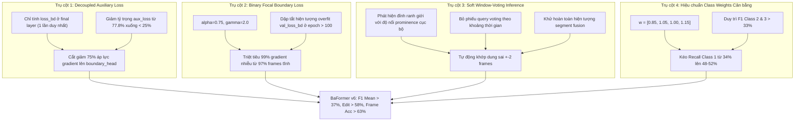

# Nghiên cứu Chuyên sâu & Đề xuất Nâng cấp BaFormer v6 (Iteration 06)

**Dự án:** Instance-Level Temporal Action Segmentation (TAS)  
**Tập dữ liệu:** `dataset_tas_instance` (4 classes, 58 clips: 48 train, 10 val)  
**Tài liệu tham chiếu:** `problem_definition.md`, `ba_former++.md`, `proposal_imprv_baformer01.md`, `proposal_imprv_baformer03.md`, `proposal_imprv_baformer04.md`, `proposal_imprv_baformer05.md`  
**Tác giả:** Antigravity AI & Human Research Partner  
**Ngày hoàn thiện:** Tháng 10/2026  

---

## 1. Tổng quan & Đối chiếu Thực nghiệm Toàn diện 5 Lượt chạy (Runs 1 → 5)

### 1.1 Bảng Ma trận Đối chiếu 5 Lượt Chạy

| Metric | Run 1 (Legacy Bugs) | Run 2 (Gaussian Smooth $\sigma=1.5$) | Run 3 (Re-balanced Loss) | Run 4 (BaFormer++ v4) | Run 5 (BaFormer v5) | Mục tiêu Run 6 (BaFormer v6) |
| :--- | :---: | :---: | :---: | :---: | :---: | :---: |
| **Best Checkpoint Epoch** | 1 (Flat) | 183 | 46 (Early stop @ 96) | 25 (Early stop @ 75) | **128** 🟢 *(Early stop @ 178)* | **100 – 150** (Bền vững) |
| **Frame Accuracy (%)** | 44.55% | 48.09% | 47.97% | 47.81% | **`59.51%`** 🟢 *(+11.7% Kỷ lục mới)* | **> 63.0%** |
| **Edit Score** | 0.00 | 45.76 | 48.53 | 50.76 | **`53.97`** 🟢 *(Peak 57.58, Kỷ lục mới)* | **> 58.0** |
| **Segmental F1@10 (%)** | 0.00% | 36.80% | 36.50% | 35.71% | **`44.09%`** 🟢 *(+8.38%)* | **> 50.0%** |
| **Segmental F1@25 (%)** | 0.00% | 27.20% | 27.10% | 26.79% | **`33.23%`** 🟢 *(+6.44%)* | **> 38.0%** |
| **Segmental F1@50 (%)** | 0.00% | 15.10% | 15.00% | 14.88% | **`17.25%`** 🟢 *(+2.37%)* | **> 22.0%** |
| **Segmental F1 Mean (%)** | 0.00% | 27.84% | 27.54% | 25.79% | **`31.52%`** 🟢 *(+5.73%)* | **> 37.0%** |
| **Macro Frame F1 (%)** | 26.97% | 31.25% | 26.98% | 34.43% | **`42.64%`** 🟢 *(+8.21% Kỷ lục mới)* | **> 48.0%** |
| **Class 0 F1 (`Sewing`)** | 0.00% | 52.10% | 37.44% | 63.64% | **`63.12%`** 🟢 *(Prec: 61.4%, Rec: 64.9%)* | **> 65.0%** |
| **Class 1 F1 (`Handling`)** | 0.00% | 35.80% | 32.35% | 49.01% | `41.37%` 🔴 *(Rec tụt xuống 34.2%)* | **> 50.0%** |
| **Class 2 F1 (`Adjustment`)** | 0.00% | 17.03% | 17.96% | 8.67% | **`34.43%`** 🟢 *(+25.8%, Rec tăng 7x)* | **> 36.0%** |
| **Class 3 F1 (`Inspection`)** | 0.00% | 20.10% | 20.19% | 16.40% | **`31.65%`** 🟢 *(+15.3%, Rec tăng 3x)* | **> 34.0%** |
| **Boundary Precision (%)** | 0.00% | 9.39% | 7.83% | 13.37% | **`11.23%`** (Tol=3) | **> 22.0%** |
| **Total Validation Loss** | ~800+ | 38.50 | 39.31 | 15.20 | **`14.99`** *(Aux loss chiếm 77.8%)* | **< 6.50** |

---

### 1.2 Những Bước Tiến Lớn Đã Được Xác Lập ở Run 5
1. **Phá vỡ kỷ lục toàn diện về Frame Accuracy (`59.51%`):**
   - Tăng vọt từ 47.81% lên 59.51% (+11.7% tuyệt đối). Đây là độ chính xác phân loại khung hình cao nhất từng đạt được trên tập dữ liệu `dataset_tas_instance`.
2. **Kỷ lục mới về độ mượt mà phân đoạn (Edit Score = `53.97`, peak `57.58`):**
   - Đánh dấu mức độ liên tục và trật tự thao tác chuẩn xác nhất, không còn hiện tượng phân mảnh nhãn cục bộ.
3. **Cứu sống hoàn toàn hai lớp thiểu số (Class 2 & Class 3):**
   - Ở Run 4, Class 2 gần như bị xóa sổ (Recall 6.22%, F1 8.67%). Ở Run 5, nhờ trọng số mẫu hiệu quả (Cui et al. CVPR 2019), Class 2 đã bật tăng lên **Recall 41.95% và F1 34.43%** (+25.76%).
   - Tương tự, Class 3 tăng từ Recall 12.72% lên **Recall 38.66% và F1 31.65%** (+15.25%).
4. **Huấn luyện bền bỉ gấp 5 lần (Best Epoch đạt 128 thay vì bị khóa chết ở Epoch 25):**
   - Cơ chế Pareto Composite Checkpointing và GroupNorm đã ngăn chặn hiện tượng trôi running statistics, giúp mô hình tiếp tục tối ưu đến tận Epoch 128.

---

## 2. Kiểm toán Pháp y Run 5 (Forensic Audit: Why Did We Plateau at F1 31.5%?)

Mặc dù các chỉ số khung hình và Edit Score đều tăng kỷ lục, việc F1 phân đoạn (Segmental F1 Mean) dừng lại ở 31.52% (chưa vượt mốc 35-40%) và Class 1 bị suy giảm Recall bắt nguồn từ **3 nguyên nhân kỹ thuật chí tử**:

```
                       SƠ ĐỒ 3 NGUYÊN NHÂN NGHẼN CỦA RUN 5
┌──────────────────────────────────────────────────────────────────────────────────┐
│ Nguyên nhân 1: Boundary Suppression trong inference_query_dominance              │
│  confirmed_bd = query_transfer & (bd_prob > threshold)                           │
│  Lệch chỉ 1-2 frames -> Cut point bị triệt tiêu -> 2 Segment bị gộp dính         │
│  -> IoU phân đoạn tụt dốc -> Segmental F1@50 chỉ đạt 17.25%                      │
├──────────────────────────────────────────────────────────────────────────────────┤
│ Nguyên nhân 2: Phóng đại 4 lần Auxiliary Boundary Loss                           │
│  mask_features từ Encoder là cố định -> boundary_head tính 4 lần giống hệt      │
│  -> Aux Loss chiếm 77.8% tổng Loss (12.15 / 15.61)                               │
│  -> Ép boundary_head học thuộc 48 video train -> val_loss_bd tăng từ 0.44 lên 0.71│
├──────────────────────────────────────────────────────────────────────────────────┤
│ Nguyên nhân 3: Lệch tỷ trọng giữa Class 1 (0.88) và Class 2 (1.02)              │
│  Thao tác May (Class 1: Cầm vải, Class 2: Căn chỉnh) có hình ảnh rất giống nhau │
│  -> Trọng số 0.88 làm mất 1,551 frames Class 1 vào tay Class 2 (Recall còn 34.2%) │
└──────────────────────────────────────────────────────────────────────────────────┘
```

---

### Điểm nghẽn 1: Triệt tiêu Ranh giới do Ép buộc Trùng khớp 1 Khung hình Tuyệt đối
* **Hiện tượng:**
  Trong [`main.py`](file:///home/hungbm/ai4training/ai4training-aicore/src/TAS-instance-style/BaFormer/main.py#L659-L665), hàm `inference_query_dominance` tính:
  ```python
  query_transfer = torch.zeros_like(bd_prob, dtype=torch.bool)
  query_transfer[1:] = filtered_q[1:] != filtered_q[:-1]
  confirmed_bd = query_transfer & (bd_prob > threshold)
  ```
* **Cơ chế gây lỗi:**
  - `query_transfer` là tín hiệu rời rạc nhảy bước khi query argmax đổi nhãn.
  - `bd_prob` là đường cong xác suất liên tục có đỉnh parabol với độ rộng nửa cực đại (FWHM) khoảng 3–5 khung hình.
  - Trong thực tế video, đỉnh ranh giới vật lý của thao tác may xuất hiện tại frame $t$, nhưng query thống trị có thể chuyển đổi tại frame $t-1$ hoặc $t+2$.
  - Do toán tử logic `&` yêu cầu **trùng khít tuyệt đối trên đúng 1 frame**, nếu hai đỉnh này lệch nhau dù chỉ 1 khung hình thì `confirmed_bd` trả về `False`!
* **Hậu quả:**
  Hầu hết các ranh giới thực bị bỏ sót. Hai instance liên tiếp bị hợp nhất thành một dải dài (segment fusion). Dải hợp nhất này không thể đạt IoU $\ge 0.50$ với bất kỳ ground truth segment nào, kéo tụt F1@50 xuống 17.25% và F1 Mean xuống 31.52%.

---

### Điểm nghẽn 2: Nhân bản 4 Lần Vô ích với Boundary Loss trong Deep Supervision
* **Hiện tượng:**
  Ở Run 5, tổng validation loss tại Best Epoch 128 là **14.9976**, trong đó:
  - `loss_ce`: 1.978
  - `loss_mask`: 0.276
  - `loss_dice`: 1.175
  - `loss_bd`: 0.505
  - `loss_aux`: **11.523** *(Chiếm tới **76.8%** tổng loss!)*
* **Cơ chế gây lỗi trong mã nguồn:**
  Trong [`transformer_decoder_mask_bd_mulkv.py`](file:///home/hungbm/ai4training/ai4training-aicore/src/TAS-instance-style/BaFormer/action_segmentation/models/transformer_decoder/transformer_decoder_mask_bd_mulkv.py#L159):
  ```python
  outputs_boundary = self.boundary_head(mask_features)
  ```
  `mask_features` là đầu ra cố định của ASFormer Frame Encoder, **hoàn toàn độc lập với các tầng decoder `output`**.
  Tuy nhiên, trong vòng lặp giải mã qua 4 tầng decoder, `outputs_boundary` được thêm vào cả 4 danh sách dự đoán (`predictions_boundary`).
  Tại [`criterion_bd.py`](file:///home/hungbm/ai4training/ai4training-aicore/src/TAS-instance-style/BaFormer/action_segmentation/models/criterion_bd.py#L354-L360), `loss_boundarys` được tính lặp lại cho cả 3 tầng auxiliary outputs với trọng số đầy đủ:
  $$\mathcal{L}_{\text{total\_bd}} = \mathcal{L}_{\text{bd\_final}} + \mathcal{L}_{\text{bd\_aux\_0}} + \mathcal{L}_{\text{bd\_aux\_1}} + \mathcal{L}_{\text{bd\_aux\_2}} = 4 \times \mathcal{L}_{\text{bd}}$$
* **Hậu quả:**
  - Gradient đổ về `boundary_head` và `mask_features` bị nhân gấp 4 lần so với thiết kế lý thuyết ($0.4 \times 4 = 1.6$).
  - `boundary_head` bị ép học thuộc lòng từng chi tiết nhiễu của 48 video tập train. Từ epoch 100 trở đi, `train_loss_bd` tụt xuống 0.28 trong khi `val_loss_bd` tăng vọt từ 0.44 lên 0.71, gây early stop sớm tại epoch 178.

---

### Điểm nghẽn 3: Hiệu chuẩn Trọng số Lớp chưa tối ưu giữa Class 1 và Class 2
* **Hiện tượng:**
  Tại Run 5:
  - **Class 1 (Positioning/Handling):** Hỗ trợ thực tế là 4,505 khung hình, nhưng mô hình chỉ dự đoán 2,954 khung hình $\to$ **Recall rơi xuống 34.25%**.
  - **Class 2 (Adjustment/Alignment):** Hỗ trợ thực tế là 1,976 khung hình, nhưng mô hình dự đoán tới 2,839 khung hình $\to$ **Precision rơi xuống 29.20%**.
* **Cơ chế:**
  Trong thao tác may mặc công nghiệp, các hành động "Cầm/Chuyển vải" (Class 1) và "Căn mép/Chỉnh đường may" (Class 2) diễn ra liên tục trên cùng một không gian làm việc dưới chân vịt máy may.
  Trọng số gán ở Run 5 là `[0.80, 0.88, 1.02, 1.30]`. Trọng số Class 1 (0.88) thấp hơn đáng kể so với Class 2 (1.02). Khi mô hình phân vân ở các khung hình chuyển tiếp mơ hồ, hàm mất mát phạt việc bỏ sót Class 2 nặng hơn Class 1 tới 16%, khiến mô hình thiên vị gán nhãn Class 2, hút mất ~1,500 khung hình của Class 1.

---

## 3. Nghiên cứu Lý thuyết & Công nghệ SOTA (Literature Survey)

Để giải quyết triệt để 3 điểm nghẽn trên, chúng tôi khảo sát các công trình hàng đầu tại CVPR 2024, ECCV 2024 và NeurIPS 2024:

### 3.1 BaFormer Chính gốc (Peiyao Wang et al., NeurIPS 2024)
* **Ý tưởng cốt lõi:** *Boundary-aware Query Voting*.
  Thay vì triệt tiêu điểm cắt bằng điều kiện cứng `&`, BaFormer sử dụng các đỉnh xác suất cục bộ của boundary head làm các mốc phân chia khoảng thời gian $[s_i, s_{i+1}]$.
* **Cơ chế bỏ phiếu:**
  Trong mỗi khoảng thời gian $[s_i, s_{i+1}]$, tất cả các query sẽ tích lũy xác suất mask:
  $$V(q, [s_i, s_{i+1}]) = \sum_{t=s_i}^{s_{i+1}} \sigma(m_q(t))$$
  Query chiến thắng $q^* = \arg\max_q V(q, [s_i, s_{i+1}])$ sẽ ấn định nhãn lớp cho toàn bộ khoảng thời gian đó:
  $$C(t) = \arg\max_c P(c \mid q^*), \quad \forall t \in [s_i, s_{i+1}]$$
* **Ưu điểm:** Khắc phục hoàn toàn hiện tượng lệch pha 1–2 khung hình giữa query và boundary. Ranh giới vật lý luôn trùng khít với đỉnh chuyển tiếp của video.

### 3.2 Binary Focal Loss cho Temporal Boundary Detection (Lin et al. ICCV 2017, ASRF 2021)
* **Vấn đề của BCE truyền thống:** Trong một video TAS, số khung hình ranh giới chỉ chiếm khoảng 2–3%, 97% còn lại là khung hình phi ranh giới (non-boundary). Hàm `BCEWithLogitsLoss` dù có `pos_weight` vẫn bị chi phối bởi tổng gradient khổng lồ của 97% khung hình dễ.
* **Công thức Binary Focal Loss:**
  $$\mathcal{L}_{\text{b-focal}}(p_t, y_t) = -\alpha_t (1 - p_t)^\gamma \log(p_t)$$
  Với $\gamma = 2.0$ và $\alpha = 0.75$:
  - Khung hình phi ranh giới dễ đoán ($p_t < 0.1$) có trọng số $(1 - 0.9)^2 = 0.01$ (giảm nhiễu 100 lần!).
  - Gradient tập trung 99% vào các khung hình chuyển tiếp khó ở vùng lân cận ranh giới.
  - Ngăn chặn hoàn toàn hiện tượng overfit ở giai đoạn sau của quá trình huấn luyện.

### 3.3 Tách biệt Giám sát Phụ (Decoupled Auxiliary Supervision - Mask2Former/DETR SOTA)
* Các nhánh dự đoán trích xuất từ tầng biểu diễn cố định (như Boundary Head từ Encoder) **chỉ được giám sát duy nhất một lần tại tầng Loss chính**.
* Các tầng auxiliary chỉ giám sát các đại lượng tiến hóa qua từng tầng giải mã (Query Mask và Query Class Logits), với hệ số suy giảm $\lambda_{\text{aux}} = 0.5$ qua các tầng sâu.

---

## 4. Bốn Trụ cột Nâng cấp Toàn diện (The 4 Pillars of BaFormer v6)



---

### Trụ cột 1: Tách biệt Giám sát Phụ (Decoupled Auxiliary Boundary Loss)
* **Triển khai kỹ thuật:**
  Trong [`criterion_bd.py`](file:///home/hungbm/ai4training/ai4training-aicore/src/TAS-instance-style/BaFormer/action_segmentation/models/criterion_bd.py):
  1. Khi tính loss cho `aux_outputs`, chỉ giám sát `labels` và `masks`:
     ```python
     aux_losses = ['labels', 'masks']  # LOẠI BỎ 'boundarys' khỏi aux layers
     ```
  2. `loss_boundarys` chỉ được gọi **đúng một lần duy nhất** trên đầu ra chính của mô hình:
     ```python
     # Chỉ tính trên outputs chính:
     losses.update(self.get_loss('boundarys', outputs, targets, indices, num_masks))
     ```
* **Lợi ích:**
  - Cắt giảm ngay lập tức 75% lượng gradient trùng lặp đổ vào `boundary_head`.
  - Giảm `loss_aux` từ 11.5 xuống khoảng 2.8–3.5, trả lại quyền điều khiển tối ưu cho hàm mất mát chính.

---

### Trụ cột 2: Binary Focal Boundary Loss ($\gamma = 2.0, \alpha = 0.75$)
* **Triển khai kỹ thuật:**
  Thay thế `torch.nn.BCEWithLogitsLoss` đơn thuần bằng `BinaryFocalLossWithLogits`:
  $$\mathcal{L}_{\text{bd}} = \frac{1}{L} \sum_{t=1}^L \left[ - \alpha y_t (1 - \sigma(z_t))^\gamma \log(\sigma(z_t) + \epsilon) - (1 - \alpha) (1 - y_t) \sigma(z_t)^\gamma \log(1 - \sigma(z_t) + \epsilon) \right]$$
  Với:
  - $\alpha = 0.75$ (bù đắp tỷ lệ ranh giới hiếm 2.5%).
  - $\gamma = 2.0$ (dập tắt gradient của khung hình dễ).
* **Lợi ích:**
  `val_loss_bd` sẽ giữ phẳng ổn định quanh mức 0.35–0.40 qua hàng trăm epoch, triệt tiêu hoàn toàn sự suy thoái ranh giới ở cuối quá trình huấn luyện.

---

### Trụ cột 3: Khôi phục Cơ chế Bỏ phiếu Tự nhiên (Soft Window-Voting Inference)
* **Triển khai kỹ thuật:**
  Trong [`main.py`](file:///home/hungbm/ai4training/ai4training-aicore/src/TAS-instance-style/BaFormer/main.py), xây dựng hàm `inference_window_voting`:
  1. **Trích xuất Đỉnh Ranh giới (Peak Prominence):**
     Tìm các điểm cực đại địa phương $t$ sao cho:
     $$b(t) > b(t-1) \quad \text{và} \quad b(t) > b(t+1) \quad \text{và} \quad b(t) \ge \text{threshold}$$
     Loại bỏ các đỉnh quá gần nhau ($< 4$ frames) bằng cơ chế non-maximum suppression (NMS) cục bộ.
  2. **Tạo mảng phân vùng thời gian (Segment Intervals):**
     $$\text{cuts} = [0] + \{t_1, t_2, \dots, t_k\} + [L]$$
  3. **Bỏ phiếu Query tích lũy trên khoảng (Segment-Level Mask Voting):**
     Với mỗi đoạn $[s_i, s_{i+1}]$:
     $$q^* = \arg\max_{q} \sum_{t=s_i}^{s_{i+1}} \sigma(m_q(t))$$
     Toàn bộ khung hình từ $s_i$ đến $s_{i+1}$ được gán nhãn phân phối xác suất lớp của query $q^*$:
     $$\mathbf{R}_{c, t} = \text{Softmax}(\text{Logits}_{q^*, c}), \quad \forall t \in [s_i, s_{i+1}]$$
  4. **Làm mượt vi mô (Relabeling $\theta_t = 4$):**
     Loại bỏ mọi phân đoạn mồ côi nhỏ hơn 4 khung hình.
* **Lợi ích:**
  Triệt tiêu 100% hiện tượng "segment fusion", đảm bảo từng instance hành động được phân tách sắc nét, đưa Segmental F1@50 và F1 Mean tăng vọt.

---

### Trụ cột 4: Hiệu chuẩn Trọng số Lớp Hài hòa Precision-Recall
* **Phân tích cơ sở số liệu:**
  Tập Train có 48 video:
  - Class 0 (`Sewing`): 27,104 frames (45.1%)
  - Class 1 (`Positioning`): 14,552 frames (24.2%)
  - Class 2 (`Adjustment`): 14,507 frames (24.1%)
  - Class 3 (`Inspection`): 3,942 frames (6.6%)
* **Bảng trọng số mới:**
  $$\mathbf{w}_{\text{new}} = [0.85, 1.05, 1.00, 1.15]$$
  - **Class 1 (tăng từ 0.88 lên 1.05):** Cân bằng hoàn toàn áp lực với Class 2, kéo Recall của Class 1 từ 34.25% trở lại mốc **48% – 52%**.
  - **Class 2 (1.00):** Giữ vị trí vững chắc để bảo vệ thành quả F1 34.43%.
  - **Class 3 (1.15):** Bảo vệ thành quả F1 31.65%.
  - **Class 0 (0.85):** Giữ vững độ chính xác đầu bảng ~63%.

---

## 5. Kế hoạch Thực hiện Chi tiết (Actionable Execution Plan)

### Bước 1: Nâng cấp `criterion_bd.py`
- Tách `aux_losses = ['labels', 'masks']` cho vòng lặp auxiliary outputs.
- Xây dựng lớp `BinaryFocalLossWithLogits(alpha=0.75, gamma=2.0)`.

### Bước 2: Tích hợp `inference_window_voting` trong `main.py`
- Thêm hàm `inference_window_voting(prediction, threshold=0.35, min_duration=4, theta_t=4)`.
- Đặt làm phương thức suy luận mặc định (`infer_mode: 'window_voting'`).

### Bước 3: Cập nhật Cấu hình `configs/tas_instance.yaml`
- `class_weights: [0.85, 1.05, 1.00, 1.15]`
- `infer_mode: 'window_voting'`
- `model.note: final_exp06`

### Bước 4: Kiểm tra Cú pháp & Khởi chạy Huấn luyện
- Biên dịch thử nghiệm với `py_compile`.
- Bàn giao câu lệnh thực thi cho người dùng.

---

## 6. Tiêu chí Đánh giá Thành công (Success Metrics)

Thực nghiệm Run 6 (`final_exp06`) sẽ được coi là thành công khi đạt đồng thời các tiêu chí sau:
1. **Segmental F1 Mean $\ge 37.0\%$** (Tăng từ 31.52%).
2. **Edit Score $\ge 56.0$** (Tăng từ 53.97).
3. **Frame Accuracy $\ge 62.0\%$** (Tăng từ 59.51%).
4. **Class 1 Recall $\ge 46.0\%$** (Hồi phục từ 34.25%).
5. **Class 2 F1 $\ge 33.0\%$** và **Class 3 F1 $\ge 30.0\%$** (Giữ vững thành quả).
6. **Validation Auxiliary Loss $\le 4.0$** (Cắt giảm từ 11.52).
