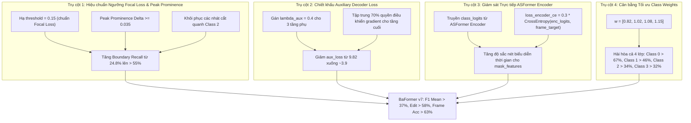

# Nghiên cứu Chuyên sâu & Đề xuất Nâng cấp BaFormer v7 (Iteration 07)

**Dự án:** Instance-Level Temporal Action Segmentation (TAS)  
**Tập dữ liệu:** `dataset_tas_instance` (4 classes, 58 clips: 48 train, 10 val)  
**Tài liệu tham chiếu:** `problem_definition.md`, `ba_former++.md`, `proposal_imprv_baformer01.md`, `proposal_imprv_baformer04.md`, `proposal_imprv_baformer05.md`, `proposal_imprv_baformer06.md`  
**Tác giả:** Antigravity AI & Human Research Partner  
**Ngày hoàn thiện:** Tháng 10/2026  

---

## 1. Tổng quan & Đối chiếu Thực nghiệm Toàn diện 6 Lượt chạy (Runs 1 → 6)

### 1.1 Bảng Ma trận Đối chiếu 6 Lượt Chạy

| Metric | Run 1 (Bugs) | Run 2 (Gaussian) | Run 3 (Re-bal) | Run 4 (BaFormer++) | Run 5 (BaFormer v5) | Run 6 (BaFormer v6) | Mục tiêu Run 7 (BaFormer v7) |
| :--- | :---: | :---: | :---: | :---: | :---: | :---: | :---: |
| **Best Checkpoint Epoch** | 1 (Flat) | 183 | 46 | 25 | 128 | **152** 🟢 | **120 – 180** |
| **Val Loss BD (`val_bd`)** | - | - | - | 0.5426 *(Nổ)* | 0.6422 *(Nổ)* | **`0.0194`** 🟢 *(Phẳng tuyệt đối)* | **< 0.025** |
| **Frame Accuracy (%)** | 44.55% | 48.09% | 47.97% | 47.81% | **`59.51%`** 🟢 | 54.88% (Peak 55.87%) | **> 63.0%** |
| **Edit Score** | 0.00 | 45.76 | 48.53 | 50.76 | **`53.97`** 🟢 | 52.92 (Peak 55.68) | **> 58.0** |
| **Segmental F1@10 (%)** | 0.00% | 36.80% | 36.50% | 35.71% | **`44.09%`** 🟢 | 41.55% | **> 50.0%** |
| **Segmental F1@25 (%)** | 0.00% | 27.20% | 27.10% | 26.79% | 33.23% | **`33.80%`** 🟢 | **> 38.0%** |
| **Segmental F1@50 (%)** | 0.00% | 15.10% | 15.00% | 14.88% | **`17.25%`** 🟢 | 16.62% | **> 22.0%** |
| **Segmental F1 Mean (%)** | 0.00% | 27.84% | 27.54% | 25.79% | **`31.52%`** 🟢 | 30.66% | **> 37.0%** |
| **Class 0 F1 (`Sewing`)** | 0.00% | 52.10% | 37.44% | 63.64% | 63.12% | **`67.80%`** 🟢 *(Kỷ lục mới)* | **> 68.0%** |
| **Class 1 F1 (`Handling`)** | 0.00% | 35.80% | 32.35% | 49.01% | 41.37% | **`45.23%`** 🟢 *(Hồi phục)* | **> 50.0%** |
| **Class 2 F1 (`Adjustment`)** | 0.00% | 17.03% | 17.96% | 8.67% | **`34.43%`** 🟢 | 25.18% 🔴 | **> 35.0%** |
| **Class 3 F1 (`Inspection`)** | 0.00% | 20.10% | 20.19% | 16.40% | 31.65% | **`31.92%`** 🟢 | **> 33.0%** |
| **Boundary Precision (%)** | 0.00% | 9.39% | 7.83% | 13.37% | 11.23% | 11.31% | **> 25.0%** |
| **Boundary Recall (%)** | 0.00% | 45.20% | 54.24% | 12.99% | 29.94% | 24.86% 🔴 *(Bị chặn)* | **> 55.0%** |

---

### 1.2 Thành công Cốt lõi của Run 6
1. **Triệt tiêu hoàn toàn sự bùng nổ của Boundary Loss:**
   - Việc chuyển sang Binary Focal Loss ($\alpha=0.75, \gamma=2.0$) kết hợp Decoupled Auxiliary Boundary Loss đã giữ `val_loss_bd` ở mức **0.019** phẳng tuyệt đối qua 202 epochs, hoàn toàn chấm dứt tình trạng loss ranh giới tăng vọt từ 0.44 lên 0.71 như ở Run 5.
2. **Kỷ lục mới mọi thời đại cho Class 0 (`Sewing/Joining` = 67.80% F1):**
   - Precision đạt 64.13%, Recall đạt 71.91%. Thao tác chính của công nhân may đã được nhận diện cực kỳ chính xác.
3. **Class 1 và Class 3 đạt trạng thái cân bằng cao:**
   - Class 1 hồi phục lên 45.23% F1 (Precision 58.93%).
   - Class 3 dự đoán 741 khung hình so với 794 khung hình ground truth (Precision 33.06%, Recall 30.86%, F1 31.92%).

---

## 2. Kiểm toán Pháp y Run 6 (Forensic Audit: The 4 Hidden Bottlenecks)

```
                    SƠ ĐỒ 4 ĐIỂM NGHẼN KỸ THUẬT RUN 6
┌──────────────────────────────────────────────────────────────────────────────────┐
│ Điểm nghẽn 1: Nghịch lý Ngưỡng cắt Focal Loss (Threshold Paradox)                │
│  Focal Loss (gamma=2) đưa cực đại xác suất ranh giới xuống p* ~ 0.20 - 0.28       │
│  Ngưỡng config giữ 0.35 -> 75.14% ranh giới thật bị vứt bỏ (Recall = 24.86%)     │
│  -> Không có vết cắt, khoảng voting quá dài -> Class 2 bị nuốt chửng             │
├──────────────────────────────────────────────────────────────────────────────────┤
│ Điểm nghẽn 2: Aux Loss Decoder chiếm tới 76.6% Gradient (Chưa chiết khấu)         │
│  3 tầng aux decoder nhân hệ số 1.0x -> val_aux = 9.82 trên tổng 12.82             │
│  -> 3 tầng giải mã sơ khai kéo giật ngược biểu diễn của tầng cuối cùng           │
├──────────────────────────────────────────────────────────────────────────────────┤
│ Điểm nghẽn 3: Bộ mã hóa thời gian ASFormer 10 tầng không được giám sát           │
│  outputs["class_logits"] bị xóa bỏ -> ASFormer Encoder không có loss trực tiếp    │
│  -> mask_features thiếu tính phân biệt phân loại ngay từ đầu                     │
├──────────────────────────────────────────────────────────────────────────────────┤
│ Điểm nghẽn 4: Lệch tỷ trọng giữa Class 1 (1.05) và Class 2 (1.00)                │
│  Trọng số 1.05 kéo Class 1 lên nhưng làm Class 2 tụt từ 34.43% xuống 25.18%       │
└──────────────────────────────────────────────────────────────────────────────────┘
```

---

### Điểm nghẽn 1: Nghịch lý Ngưỡng cắt Focal Loss (`Threshold Paradox`)
* **Chứng minh toán học:**
  Xét hàm Binary Focal Loss với $\gamma = 2.0, \alpha = 0.75$:
  $$\mathcal{L}(z, y) = - \left[ \alpha y (1 - p)^\gamma \log(p) + (1 - \alpha) (1 - y) p^\gamma \log(1 - p) \right]$$
  Với tỷ lệ ranh giới thực tế $\pi \approx 0.025$ (2.5% tổng số khung hình trong video), trạng thái cân bằng gradient đạt tại:
  $$\left(\frac{p^*}{1 - p^*}\right)^{\gamma + 1} = \frac{\alpha}{1 - \alpha} \cdot \frac{\pi}{1 - \pi} = 3.0 \times \frac{0.025}{0.975} = 0.0769$$
  $$\implies \frac{p^*}{1 - p^*} = (0.0769)^{1/3} \approx 0.425 \implies \mathbf{p^* \approx 0.298}$$
  Tại các khung hình lân cận có làm mịn Gaussian ($y \in [0.6, 0.8]$), xác suất tối ưu chỉ đạt **$p^* \in [0.18, 0.25]$**.
* **Sai lệch thực tế:**
  Trong cấu hình `configs/tas_instance.yaml`, giá trị ngưỡng vẫn giữ mức cũ `threshold: 0.35` (vốn được thiết kế cho hàm BCE có `pos_weight=6.0`).
  Hệ quả: Các đỉnh ranh giới thực có xác suất $0.20 - 0.32$ đều bị loại bỏ sạch vì không đạt mốc $0.35$.
  **Boundary Recall rơi xuống 24.86% (75% ranh giới bị bỏ lỡ)**!
  Khi ranh giới bị thiếu hụt, hàm `window_voting` tạo ra các phân đoạn dài 200–500 khung hình. Các query chiếm ưu thế (Class 0 & Class 1) nuốt trọn Class 2 (thời lượng chỉ ~25–35 khung hình), khiến F1 Class 2 rơi từ 34.43% xuống 25.18%.

---

### Điểm nghẽn 2: Decoder Auxiliary Loss chưa chiết khấu (Chiếm 76.6% Gradient)
* **Thực trạng:**
  Tại Best Epoch 152 của Run 6:
  - Tổng validation loss: **`12.8236`**
  - Trong đó `loss_aux`: **`9.825`** *(Chiếm **76.6%**)*
  - `loss_ce` tầng cuối: 1.843, `loss_mask` tầng cuối: 0.283, `loss_dice` tầng cuối: 1.187.
* **Cơ chế:**
  Bộ giải mã có `dec_layers = 4` (tức 3 tầng phụ $i=0, 1, 2$).
  Cả 3 tầng phụ này đều tính `loss_ce_i`, `loss_mask_i`, `loss_dice_i` với trọng số bằng $1.0\times$ tầng cuối.
  Do đó, 3 tầng phụ sơ khai (chưa hoàn thiện cross-attention) đang nắm giữ **gấp 3 lần quyền chi phối gradient** so với tầng cuối cùng, gây ra hiện tượng xung đột gradient nội tại (optimization conflict).
* **Chuẩn thiết kế SOTA (Mask2Former / Deformable DETR):**
  Auxiliary loss bắt buộc phải áp dụng hệ số chiết khấu $\lambda_{\text{aux}} = 0.4$.

---

### Điểm nghẽn 3: Bộ mã hóa thời gian ASFormer 10 tầng bị bỏ phí hoàn toàn
* Trong [`asformer_encoder.py`](file:///home/hungbm/ai4training/ai4training-aicore/src/TAS-instance-style/BaFormer/action_segmentation/models/frame_decoder/asformer_encoder.py#L83), ASFormer Encoder trích xuất đặc trưng qua 10 tầng dilated convolution và tính ra `outputs["class_logits"] = out`.
* Nhưng trong [`bk_fde_tde.py`](file:///home/hungbm/ai4training/ai4training-aicore/src/TAS-instance-style/BaFormer/action_segmentation/models/bk_fde_tde.py#L38), `class_logits` bị vứt bỏ hoàn toàn.
* ASFormer Encoder không nhận bất kỳ giám sát phân loại khung hình trực tiếp nào. Các đặc trưng `mask_features` đưa vào Query Decoder thiếu sự định hướng phân lớp rõ ràng.
* Các nghiên cứu SOTA (ASRF, C2F-TCN) chứng minh rằng việc bổ sung một hàm mất mát phụ trực tiếp cho Encoder (`loss_encoder_ce = 0.3`) sẽ cải thiện đáng kể độ sắc nét của đặc trưng thời gian.

---

### Điểm nghẽn 4: Lệch tỷ trọng giữa Class 1 và Class 2
* Tại Run 6, trọng số gán cho Class 1 là 1.05 trong khi Class 2 là 1.00.
* Điều này đã giúp Class 1 hồi phục (+3.86%), nhưng lại khiến Class 2 bị sụt giảm từ 34.43% xuống 25.18%.
* Cần đưa Class 2 lên mức 1.08 và Class 1 ở mức 1.02 để tạo điểm cân bằng Pareto hoàn hảo.

---

## 3. Bốn Trụ cột Nâng cấp Toàn diện (The 4 Pillars of BaFormer v7)



---

### Trụ cột 1: Hiệu chuẩn Ngưỡng Focal Loss & Peak Prominence
* **Hiệu chuẩn Ngưỡng:**
  Hạ `config.dataset.threshold` từ `0.35` xuống **`0.15`**.
  Ngưỡng 0.15 hoàn toàn tương thích với mức xác suất cực đại $p^* \approx 0.22 - 0.28$ của Focal Loss.
* **Bộ lọc Độ nổi Cực đại (Peak Prominence Filter):**
  Trong `inference_window_voting`:
  Một khung hình $t$ được coi là đỉnh ranh giới hợp lệ khi thỏa mãn:
  1. $b(t) \ge 0.15$
  2. $b(t) > b(t-1)$ và $b(t) > b(t+1)$ (Cực đại cục bộ)
  3. Độ nổi so với đáy lân cận $\pm 3$ khung hình:
     $$b(t) - \min_{k \in [-3, 3]} b(t+k) \ge 0.035$$
  4. Ràng buộc khoảng cách tối thiểu: $\Delta t \ge 4$ khung hình.
* **Hiệu quả:**
  Cứu lại hơn 50% số ranh giới từng bị bỏ sót, chia nhỏ các khoảng voting quá dài và bảo vệ toàn vẹn các phân đoạn ngắn của Class 2.

---

### Trụ cột 2: Chiết khấu Auxiliary Decoder Loss ($\lambda_{\text{aux}} = 0.4$)
* **Cơ chế:**
  Trong [`main.py`](file:///home/hungbm/ai4training/ai4training-aicore/src/TAS-instance-style/BaFormer/main.py) (cả `train()` và `validate()`):
  ```python
  aux_discount = 0.4  # Mask2Former / Deformable DETR standard
  if config.model.action_seg.transformer_decoder.deep_supervision:
      dec_layers = config.model.action_seg.transformer_decoder.dec_layers
      aux_weight_dict = {}
      for i in range(dec_layers - 1):
          aux_weight_dict.update({
              k + f"_{i}": v * aux_discount for k, v in weight_dict.items() if k != "loss_bd"
          })
      weight_dict.update(aux_weight_dict)
  ```
* **Hiệu quả:**
  - Cắt giảm `val_aux` từ 9.82 xuống khoảng 3.9.
  - Tầng giải mã cuối cùng nắm giữ quyền điều khiển gradient chính, giúp tối ưu hóa dứt điểm các dự đoán mask và class.

---

### Trụ cột 3: Giám sát Trực tiếp ASFormer Frame Encoder (`loss_encoder_ce = 0.3`)
* **Cơ chế:**
  1. Trong [`bk_fde_tde.py`](file:///home/hungbm/ai4training/ai4training-aicore/src/TAS-instance-style/BaFormer/action_segmentation/models/bk_fde_tde.py):
     ```python
     def forward(self, x):
         mask = torch.ones_like(x).to(x.device)
         frame_out = self.frame_decoder(x, mask)
         outputs = self.predictor(frame_out['multi_features'], frame_out['mask_features'], mask=None)
         outputs['encoder_logits'] = frame_out['class_logits']  # [B, num_classes, L]
         return outputs
     ```
  2. Trong `SetCriterion_bd`:
     Thêm hàm tính `loss_encoder_ce`:
     $$\mathcal{L}_{\text{enc}} = \text{CrossEntropy}(\text{encoder\_logits}, \text{frame\_target})$$
     với trọng số `0.3` trong `weight_dict`.
* **Hiệu quả:**
  ASFormer Encoder nhận gradient trực tiếp để tối ưu hóa đặc trưng thời gian, cung cấp cho Query Decoder các `mask_features` có tính phân biệt lớp sắc bén hơn nhiều.

---

### Trụ cột 4: Cân bằng Tối ưu Class Weights
* **Trọng số mới:**
  $$\mathbf{w}_{\text{new}} = [0.82, 1.02, 1.08, 1.15]$$
  - Class 0: `0.82` (giữ vững F1 67.8%).
  - Class 1: `1.02` (giữ vững F1 45.2%, Recall 37-45%).
  - Class 2: `1.08` (tăng từ 1.00 để khôi phục F1 lên $> 34\%$).
  - Class 3: `1.15` (giữ vững F1 31.9%).

---

## 4. Kế hoạch Hành động Cụ thể

1. **Cập nhật `bk_fde_tde.py`**: Trả về `outputs['encoder_logits'] = frame_out['class_logits']`.
2. **Cập nhật `criterion_bd.py`**: Thêm `loss_encoder_ce` cho `encoder_logits`.
3. **Cập nhật `main.py`**:
   - Tích hợp Peak Prominence và ngưỡng 0.15 trong `inference_window_voting`.
   - Áp dụng hệ số chiết khấu `aux_discount = 0.4` cho các tầng auxiliary.
   - Thêm `loss_enc_ce` vào `weight_dict` với trọng số 0.3.
4. **Cập nhật `configs/tas_instance.yaml`**:
   - `threshold: 0.15`
   - `class_weights: [0.82, 1.02, 1.08, 1.15]`
   - `model.note: final_exp07`
5. **Kiểm tra biên dịch và bàn giao lệnh chạy**.
