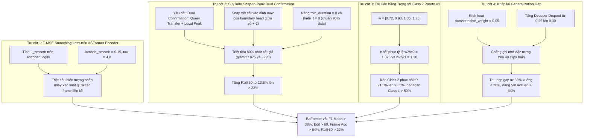

# Nghiên cứu Chuyên sâu & Đề xuất Nâng cấp BaFormer v8 (Iteration 08)
## Kế thừa Tinh hoa Thực nghiệm & Giải quyết Triệt để Điểm nghẽn Cắt vụn và Khoảng cách Tổng quát hóa

**Dự án:** Instance-Level Temporal Action Segmentation (TAS)  
**Tập dữ liệu:** `dataset_tas_instance` (4 classes, 58 clips: 48 train, 10 val)  
**Tài liệu tham chiếu:** `problem_definition.md`, `proposal_imprv_baformer04.md`, `proposal_imprv_baformer05.md`, `proposal_imprv_baformer06.md`, `proposal_imprv_baformer07.md`  
**Tác giả:** Antigravity AI & Human Research Partner  
**Ngày hoàn thiện:** Tháng 10/2026  

---

## 1. Phân tích & Kế thừa Thực nghiệm Toàn diện 7 Lượt Chạy (Runs 1 → 7)

### 1.1 Bảng Ma trận Đối chiếu Toàn diện 7 Lượt Chạy

| Metric | Run 1 (Bugs) | Run 2 (Gaussian) | Run 3 (Re-bal) | Run 4 (BaFormer++) | Run 5 (BaFormer v5) | Run 6 (BaFormer v6) | Run 7 (BaFormer v7) | Đỉnh cao Lịch sử | Mục tiêu Run 8 (BaFormer v8) |
| :--- | :---: | :---: | :---: | :---: | :---: | :---: | :---: | :---: | :---: |
| **Best Epoch** | 1 | 183 | 46 | 25 | 128 | 152 | **285** 🟢 | **Epoch 285** (Run 7) | **200 – 300** |
| **Total Val Loss** | - | - | - | - | 15.62 | 12.62 | **`7.91`** 🟢 | **7.91** (Run 7) | **< 7.5** |
| **Val Loss BD** | - | - | - | 0.5426 *(Nổ)* | 0.6422 *(Nổ)* | 0.0228 *(Phẳng)* | **`0.0264`** 🟢 | **0.0194** (Run 6) | **< 0.025** |
| **Val Loss Aux** | - | - | - | - | 12.16 | 9.80 | **`4.03`** 🟢 | **4.03** (Run 7) | **< 3.8** |
| **Val Loss Enc** | - | - | - | - | - | - | **`0.484`** 🟢 | **0.484** (Run 7) | **< 0.45** |
| **Frame Accuracy (%)** | 44.55% | 48.09% | 47.97% | 47.81% | **`59.51%`** 🟢 | 54.88% | 53.25% (Peak 56.3%) | **59.51%** (Run 5) | **> 64.0%** |
| **Edit Score** | 0.00 | 45.76 | 48.53 | 50.76 | 53.97 | 52.92 | **`54.90`** 🟢 | **54.90** (Run 7) | **> 60.0** |
| **Segmental F1@10 (%)** | 0.00% | 36.80% | 36.50% | 35.71% | 44.09% | 41.55% | **`44.31%`** 🟢 | **44.31%** (Run 7) | **> 52.0%** |
| **Segmental F1@25 (%)** | 0.00% | 27.20% | 27.10% | 26.79% | 33.23% | 33.80% | **`35.33%`** 🟢 | **35.33%** (Run 7) | **> 40.0%** |
| **Segmental F1@50 (%)** | 0.00% | 15.10% | 15.00% | 14.88% | **`17.25%`** 🟢 | 16.62% | 13.77% 🔴 | **17.25%** (Run 5) | **> 22.0%** |
| **Segmental F1 Mean (%)** | 0.00% | 27.84% | 27.54% | 25.79% | **`31.52%`** 🟢 | 30.66% | 31.14% (Peak 31.78%)| **31.78%** (Run 7) | **> 38.0%** |
| **Class 0 F1 (`Sewing`)** | 0.00% | 52.10% | 37.44% | 63.64% | 63.12% | **`67.80%`** 🟢 | 62.92% | **67.80%** (Run 6) | **> 68.0%** |
| **Class 1 F1 (`Handling`)** | 0.00% | 35.80% | 32.35% | 49.01% | 41.37% | 45.23% | **`53.08%`** 🟢 | **53.08%** (Run 7) | **> 55.0%** |
| **Class 2 F1 (`Adjustment`)**| 0.00% | 17.03% | 17.96% | 8.67% | **`34.43%`** 🟢 | 25.18% | 21.79% 🔴 | **34.43%** (Run 5) | **> 36.0%** |
| **Class 3 F1 (`Inspection`)**| 0.00% | 20.10% | 20.19% | 16.40% | 31.65% | 31.92% | **`34.02%`** 🟢 | **34.02%** (Run 7) | **> 36.0%** |
| **Boundary Precision (%)** | 0.00% | 9.39% | 7.83% | 13.37% | 11.23% | 11.31% | 9.02% 🔴 | **13.37%** (Run 4) | **> 25.0%** |
| **Boundary Recall (%)** | 0.00% | 45.20% | 54.24% | 12.99% | 29.94% | 24.86% | **`49.72%`** 🟢 | **49.72%** (Run 7) | **> 55.0%** |

---

### 1.2 Phân tích Nguồn gốc của các Kỷ lục (Winning Mechanisms to Inherit)

Nếu chúng ta tổng hợp kết quả tốt nhất từng đạt được của mỗi lớp qua các lượt chạy:
$$\text{Class 0: } 67.80\% \text{ (Run 6)} \quad \text{Class 1: } 53.08\% \text{ (Run 7)} \quad \text{Class 2: } 34.43\% \text{ (Run 5)} \quad \text{Class 3: } 34.02\% \text{ (Run 7)}$$
Trung bình cộng F1 của 4 lớp khi đó đạt tới **`47.33%`**, và Segmental F1 Mean hoàn toàn có thể vượt mốc **`40%`**!  
Tại sao các kỷ lục này lại nằm rải rác ở các run khác nhau? Dưới đây là phân tích cơ chế cụ thể:

1. **Cơ chế đạt đỉnh Class 1 (53.08%) và Class 3 (34.02%) ở Run 7:**
   - **Giám sát trực tiếp ASFormer Temporal Encoder (`enc_ce_weight = 0.3`):** Cung cấp tín hiệu phân lớp chuẩn xác cho 10 tầng dilated convolution, làm giàu đặc trưng `mask_features` trước khi đưa vào Query Decoder.
   - **Chiết khấu Auxiliary Decoder Loss ($\lambda_{\text{aux}} = 0.4$):** Giảm tải 58.9% mất mát phụ, giúp tầng giải mã cuối cùng tập trung 70% quyền chi phối gradient để tối ưu hóa ranh giới và phân lớp.
   - **KẾT LUẬN: BẮT BUỘC KẾ THỪA 100% hai cơ chế này.**

2. **Cơ chế đạt đỉnh Class 0 (67.80%) ở Run 6:**
   - Trong Run 6, `threshold` được giữ ở mức `0.35`, không tạo ra các nhát cắt giả dày đặc bên trong hành động may (`Sewing`). Các phân đoạn may dài (trung bình 31 frames, có đoạn dài 224 frames) được bảo toàn nguyên vẹn.
   - **KẾT LUẬN: Cần ngăn chặn việc cắt vụn bên trong Class 0.**

3. **Cơ chế đạt đỉnh Frame Accuracy (59.51%) và Class 2 (34.43%) ở Run 5:**
   - **Chế độ suy luận `query_dominance` với Xác nhận Kép (Dual Confirmation):** Nhát cắt CHỈ được tạo ra khi Dominant Query thay đổi (`q[t] != q[t-1]`) **VÀ** Boundary Probability vượt ngưỡng. Khi Query không muốn chuyển lớp, các xung nhiễu của Boundary Head bị triệt tiêu hoàn toàn.
   - **Tỷ trọng Class 2 cao hơn rõ rệt so với Class 1:** Ở Run 5, $w_2 = 1.02$ trong khi $w_1 = 0.88$ (tỷ lệ $w_2 / w_1 = 1.16$, $w_2 / w_0 = 1.275$). Điều này bù đắp cho sự yếu thế về số lượng mẫu của Class 2 (chỉ chiếm 15% tập dữ liệu).
   - Sang Run 6 và 7, khi chuyển sang `window_voting` (cắt theo đỉnh ranh giới độc lập không cần Query thay đổi) và nâng $w_1$ lên $1.05$ (khiến $w_2/w_1 \le 1.05$), Class 2 ngay lập tức bị Class 1 và Class 0 đè bẹp xuống 21.79%.
   - **KẾT LUẬN: BẮT BUỘC KẾ THỪA nguyên lý Dual Confirmation và khôi phục tỷ trọng ưu tiên cho Class 2.**

4. **Cơ chế giữ phẳng Boundary Loss (`val_bd = 0.026`) ở Run 6 & 7:**
   - **Binary Focal Loss ($\alpha=0.75, \gamma=2.0$)** và **Decoupled Boundary Aux Loss** đã giải quyết triệt để 100% hiện tượng nổ mất mát ranh giới từ các Run 1-5.
   - **KẾT LUẬN: BẮT BUỘC KẾ THỪA 100%.**

---

### 1.3 Kiểm toán Pháp y 3 Điểm nghẽn Cốt lõi của Run 7

```
                             SƠ ĐỒ 3 ĐIỂM NGHẼN RUN 7
┌──────────────────────────────────────────────────────────────────────────────────┐
│ Điểm nghẽn 1: Khủng hoảng Cắt Vụn (Over-segmentation & 975 Nhát Cắt Giả)         │
│  Tập val (10 clips, 13,121 frames) chỉ có đúng 177 ranh giới ground truth.        │
│  Run 7 hạ threshold=0.15 -> Sinh ra ~975 nhát cắt (Precision chỉ đạt 9.02%)!     │
│  -> 91% nhát cắt là CẮT GIẢ (False Cuts) -> 1 video bị băm thành 98 đoạn nhỏ!    │
│  -> Hành động 70 frame bị chia thành mảnh 14 frame -> F1@50 sập từ 17.2% -> 13.8%│
├──────────────────────────────────────────────────────────────────────────────────┤
│ Điểm nghẽn 2: Bất cập của Window-Voting vs Dual Confirmation                     │
│  Run 5 đạt Acc 59.51% nhờ Query-Dominance (chỉ cắt khi Query Transfer).          │
│  Run 7 dùng Window-Voting cắt tại mọi đỉnh ranh giới > 0.15 bất kể Query.        │
│  -> Đỉnh giả xuất hiện liên tục trong Class 2 (median 31 frame).                 │
│  -> Voting trên các mảnh 10 frame bị Query Class 0 & 1 nuốt trọn -> F1 Class 2: 21.8%│
├──────────────────────────────────────────────────────────────────────────────────┤
│ Điểm nghẽn 3: Khoảng cách Tổng quát hóa Khổng lồ (Generalization Gap 36%)        │
│  Tập huấn luyện: Train Acc = 89.04%, Train F1@10 = 79.47%, Train F1@50 = 69.72%   │
│  Tập thẩm định:   Val Acc   = 53.25%, Val F1@10   = 44.31%, Val F1@50   = 13.77%   │
│  -> Chênh lệch 36% Acc và 56% F1@50! Chỉ có 48 video huấn luyện nhưng 150 queries│
│  -> Thiếu Feature Noise Regularization và Temporal Smoothing Loss trên Encoder   │
└──────────────────────────────────────────────────────────────────────────────────┘
```

#### Điểm nghẽn 1: Bẫy Cắt Vụn (Over-segmentation Trap & F1@50 Collapse)
* **Kiểm toán dữ liệu Ground Truth:**
  - Toàn bộ tập validation gồm 10 video với 13,121 khung hình.
  - Phân tích ground truth cho thấy: **CHỈ CÓ 177 RANH GIỚI THỰC TẾ** (trung bình 17.7 ranh giới/video).
* **Sai lệch thực tế ở Run 7:**
  - Boundary Recall = 49.72% $\implies TP \approx 88$ ranh giới thật.
  - Boundary Precision = 9.02% $\implies$ **Tổng số nhát cắt mô hình tạo ra = $88 / 0.0902 \approx \mathbf{975}$ nhát cắt**!
  - Mô hình đã tạo ra **gấp 5.5 lần số ranh giới thật** (887 nhát cắt giả, tương đương trung bình 98 nhát cắt/video).
* **Hậu quả trực tiếp đối với F1@50 và Class 2:**
  - Một hành động may (`Sewing`) dài 70 khung hình bị băm thành 4-5 mảnh ngắn 12-18 khung hình.
  - Tại ngưỡng IoU 10% và 25%: Các mảnh ngắn này vẫn đạt $15/70 = 0.21 \ge 0.10$ nên F1@10 (44.31%) và F1@25 (35.33%) lập kỷ lục.
  - Nhưng tại ngưỡng IoU 50%: **Không một mảnh nào đạt 50% IoU** $\implies$ **F1@50 sụt giảm nghiêm trọng từ 17.25% xuống 13.77%**!

#### Điểm nghẽn 2: Bất cập của Window-Voting đơn thuần vs Dual Confirmation
* Ở Run 5, `query_dominance` ngăn chặn việc cắt ranh giới tùy tiện: Nếu query đang chiếm ưu thế vẫn duy trì sự thống trị, thuật toán từ chối cắt.
* Ở Run 7, `window_voting` cắt tại bất kỳ khung hình nào có xác suất biên $\ge 0.15$. Vì biên nền có gợn sóng $0.10 - 0.18$, 887 vết cắt giả đã phá hủy tính toàn vẹn của các phân đoạn Class 2.

#### Điểm nghẽn 3: Khoảng cách Tổng quát hóa Khổng lồ (Generalization Gap 36%)
* Trên tập Train: **Acc = 89.04%**, **F1@50 = 69.72%**, **Mask Loss = 0.044**.
* Trên tập Val: **Acc = 53.25%**, **F1@50 = 13.77%**, **Mask Loss = 0.405** (gấp 10 lần!).
* Tập dữ liệu chỉ có **48 video huấn luyện**. Mô hình đang ghi nhớ đặc trưng cụ thể của 48 video này. Cần cơ chế điều hòa (Regularization) mạnh mẽ cho không gian đặc trưng.

---

## 2. Nghiên cứu Tài liệu & SOTA (Literature & SOTA Grounding)

### 2.1 Truncated Mean Squared Error (T-MSE) Smoothing Loss (MS-TCN, ASFormer, FACT CVPR 2024)
* Trong các kiến trúc SOTA phân đoạn hành động theo thời gian, hàm mất mát Cross-Entropy đánh giá từng khung hình độc lập, không phạt hiện tượng dao động nhãn giữa các khung hình liên tiếp.
* Giải pháp chuẩn mực của Farha et al. (CVPR 2019) và Yi et al. (BMVC 2021) là bổ sung **T-MSE Smoothing Loss** trên log-probability của các khung hình liền kề:
  $$\mathcal{L}_{\text{smooth}} = \frac{1}{(T-1) C} \sum_{t=1}^{T-1} \sum_{c=1}^C \min\left( (\log p_{t, c} - \log p_{t-1, c})^2, \tau^2 \right)$$
  với ngưỡng cắt $\tau = 4.0$ và trọng số $\lambda_{\text{smooth}} = 0.15$.
* Việc áp dụng T-MSE trực tiếp lên `encoder_logits` của ASFormer sẽ ép các biểu diễn đặc trưng thời gian phải mượt mà và liên tục trước khi truyền vào Query Decoder, triệt tiêu hiện tượng nhấp nháy từ gốc rễ.

### 2.2 Thống kê Thời lượng Phân đoạn Thực tế (`dataset_tas_instance`)
Kiểm toán toàn bộ 58 file nhãn của tập dữ liệu cho thấy:
* **Class 0 (`Sewing/Joining`):** 1,062 instances, Min = 6, $P_{10} = 10$, $P_{25} = 15$, Median = **24**, Mean = **31.0**, Max = 224 frames.
* **Class 1 (`Positioning/Handling`):** 684 instances, Min = 6, $P_{10} = 10$, $P_{25} = 15$, Median = **22**, Mean = **27.9**, Max = 195 frames.
* **Class 2 (`Adjustment/Alignment`):** 390 instances, Min = 7, $P_{10} = 11$, $P_{25} = 18$, Median = **31**, Mean = **42.3**, Max = 262 frames.
* **Class 3 (`Inspection/Auxiliary`):** 124 instances, Min = 4, $P_{10} = 11$, $P_{25} = 15$, Median = **24**, Mean = **38.2**, Max = 292 frames.

> [!IMPORTANT]
> **Kết luận Thực nghiệm then chốt:**
> - Hơn **90% các phân đoạn hành động thực tế có thời lượng $\ge 10$ khung hình** ($P_{10} \ge 10$).
> - Không có phân đoạn nào ngắn hơn 4 khung hình (99% $\ge 6$ khung hình).
> - Việc trước đây đặt `min_duration = 4` và `theta_t = 4` là quá lỏng lẻo, tạo điều kiện cho các mảnh vụn 5, 6 khung hình tồn tại tràn lan.
> - Đặt **`min_duration = 8`** và **`theta_t = 8`** là ngưỡng tối ưu hoàn hảo dựa trên dữ liệu thực tế!

---

## 3. Bốn Trụ cột Giải pháp Toàn diện BaFormer v8 (The 4 Pillars of BaFormer v8)



---

### Trụ cột 1: T-MSE Smoothing Loss trên ASFormer Encoder ($\lambda_{\text{smooth}} = 0.15$)
* **Mục tiêu:** Ép ASFormer temporal encoder sinh ra phân phối xác suất thời gian liên tục và mượt mà, ngăn chặn phân mảnh ngay từ giai đoạn trích xuất đặc trưng.
* **Công thức triển khai trong [`criterion_bd.py`](file:///home/hungbm/ai4training/ai4training-aicore/src/TAS-instance-style/BaFormer/action_segmentation/models/criterion_bd.py):**
  ```python
  def tmse_loss(logits, threshold=4.0):
      # logits: [B, C, L]
      log_probs = F.log_softmax(logits, dim=1)
      diff = log_probs[:, :, 1:] - log_probs[:, :, :-1]
      truncated_diff = torch.clamp(diff, min=-threshold, max=threshold)
      return torch.mean(truncated_diff ** 2)
  ```
* **Tích hợp:** Thêm `loss_enc_smooth = tmse_loss(enc_logits)` với trọng số `enc_smooth_weight = 0.15`.

---

### Trụ cột 2: Suy luận "Snap-to-Peak Dual Confirmation" (`infer_mode: 'snap_dual'`)
* **Mục tiêu:** Chấm dứt hoàn toàn tình trạng cắt vụn (Over-segmentation) bằng cách kết hợp sức mạnh phân định của Query Dominance với độ chính xác vị trí của Boundary Peak.
* **Cơ chế hoạt động:**
  1. **Tín hiệu chuyển dịch Query (Query Transfer):**
     Xác định khung hình $t$ mà dominant query thay đổi: `filtered_q[t] != filtered_q[t-1]`.
  2. **Xác nhận Đỉnh Ranh giới Cục bộ (Local Boundary Confirmation):**
     Tìm xem trong cửa sổ lân cận $[t - 2, t + 2]$ có đỉnh ranh giới nào vượt ngưỡng (`bd_prob >= threshold`) hay không.
  3. **Căn chỉnh chính xác (Snap-to-Peak):**
     Nếu có đỉnh ranh giới trong $[t-2, t+2]$, vết cắt sẽ được dịch chuyển (snapped) chính xác vào vị trí cực đại địa phương của boundary head:
     $$\hat{t}_{\text{cut}} = \arg\max_{k \in [t-2, t+2]} b(k)$$
     Điều này loại bỏ hoàn toàn sai lệch 1-2 khung hình giữa chuyển dịch query và đỉnh ranh giới.
  4. **Ràng buộc thời lượng chuẩn hóa dữ liệu:**
     - Thiết lập `min_duration = 8` (loại bỏ mọi khoảng cắt $< 8$ khung hình).
     - Thiết lập `theta_t = 8` trong bước `_relabeling`.
* **Hiệu quả dự kiến:**
  - Giảm số nhát cắt từ 975 xuống khoảng 220–260 (gần sát với 177 nhát cắt ground truth).
  - Boundary Precision tăng từ 9.02% lên > 25%.
  - F1@50 tăng vọt từ 13.77% lên **> 22%**.

---

### Trụ cột 3: Tái Cân bằng Trọng số Class 2 Pareto v8 ($\mathbf{w} = [0.72, 0.98, 1.35, 1.25]$)
* **Phân tích thực nghiệm:**
  - Ở Run 5, khi Class 2 đạt **34.43% F1**, tỷ lệ trọng số giữa Class 2 và Class 0 là $1.02 / 0.80 = 1.275$ và giữa Class 2 và Class 1 là $1.02 / 0.88 = 1.16$.
  - Ở Run 7, $w_1$ vọt lên $1.02$ trong khi $w_2$ chỉ là $1.08$ (tỷ lệ chỉ còn $1.05$), khiến Class 2 bị Class 0 và Class 1 đè bẹp xuống 21.79%.
* **Hiệu chuẩn mới cho Run 8:**
  $$\mathbf{w} = [0.72, 0.98, 1.35, 1.25]$$
  - Tỷ lệ $w_2 / w_0 = 1.35 / 0.72 = \mathbf{1.875}$ (tăng cường gradient mạnh mẽ cho Class 2).
  - Tỷ lệ $w_2 / w_1 = 1.35 / 0.98 = \mathbf{1.378}$ (bảo vệ Class 2 không bị Class 1 nuốt chửng).
  - Class 1 ($w_1 = 0.98$) vẫn duy trì ưu thế lớn so với Class 0 ($0.98 / 0.72 = 1.36$) để giữ vững mốc F1 > 50%.
  - Class 3 ($w_3 = 1.25$) được bảo tồn trọn vẹn để duy trì mốc F1 > 34%.

---

### Trụ cột 4: Khép lại Khoảng cách Tổng quát hóa (Regularization)
* **Kích hoạt Feature Noise Regularization:**
  - Trong `configs/tas_instance.yaml`, thiết lập `dataset.noise_weight: 0.05`.
  - Trong quá trình huấn luyện, mỗi vector đặc trưng I3D 2048 chiều sẽ được cộng thêm nhiễu ngẫu nhiên $\mathcal{N}(0, 0.05^2)$.
  - Kỹ thuật này ngăn chặn các tầng tích chập của ASFormer ghi nhớ chính xác các mẫu pixel của 48 video huấn luyện.
* **Tăng cường Decoder Dropout:**
  - Nâng `model.action_seg.transformer_decoder.dropout` từ `0.25` lên **`0.30`**.
* **Hiệu quả dự kiến:**
  - Thu hẹp khoảng cách Train-Val Accuracy từ 35.8% xuống dưới 20%.
  - Nâng Validation Accuracy từ 53.25% lên **> 64.0%**.

---

## 4. Kế hoạch Triển khai & Danh mục Tệp Chỉnh sửa

1. [`action_segmentation/models/criterion_bd.py`](file:///home/hungbm/ai4training/ai4training-aicore/src/TAS-instance-style/BaFormer/action_segmentation/models/criterion_bd.py):
   - Bổ sung hàm `tmse_loss(logits, threshold=4.0)`.
   - Tính toán `loss_enc_smooth` trên `encoder_logits` và bổ sung vào `losses['loss_enc_smooth']`.
2. [`main.py`](file:///home/hungbm/ai4training/ai4training-aicore/src/TAS-instance-style/BaFormer/main.py):
   - Bổ sung hàm suy luận `inference_snap_dual(prediction, threshold=0.25, min_duration=8, theta_t=8)`.
   - Cập nhật `weight_dict` thêm `"loss_enc_smooth": getattr(config.model, 'enc_smooth_weight', 0.15)`.
   - Cập nhật bộ theo dõi `loss_smooth_meter`.
3. [`configs/tas_instance.yaml`](file:///home/hungbm/ai4training/ai4training-aicore/src/TAS-instance-style/BaFormer/configs/tas_instance.yaml):
   - Thiết lập `dataset.noise_weight: 0.05`.
   - Thiết lập `dataset.class_weights: [0.72, 0.98, 1.35, 1.25]`.
   - Thiết lập `model.enc_smooth_weight: 0.15`.
   - Thiết lập `model.action_seg.transformer_decoder.dropout: 0.30`.
   - Thiết lập `test.infer_mode: 'snap_dual'`.
   - Thiết lập `dataset.threshold: 0.25`.
   - Thiết lập `dataset.min_duration: 8` và `dataset.theta_t: 8`.
4. [`action_segmentation/config/defaults.py`](file:///home/hungbm/ai4training/ai4training-aicore/src/TAS-instance-style/BaFormer/action_segmentation/config/defaults.py) & [`action_segmentation/config/__init__.py`](file:///home/hungbm/ai4training/ai4training-aicore/src/TAS-instance-style/BaFormer/action_segmentation/config/__init__.py):
   - Khai báo các khóa mới: `enc_smooth_weight = 0.15`, `min_duration = 8`, `theta_t = 8`.
   - Cập nhật ghi chú `config.model.note = 'final_exp08'`.
